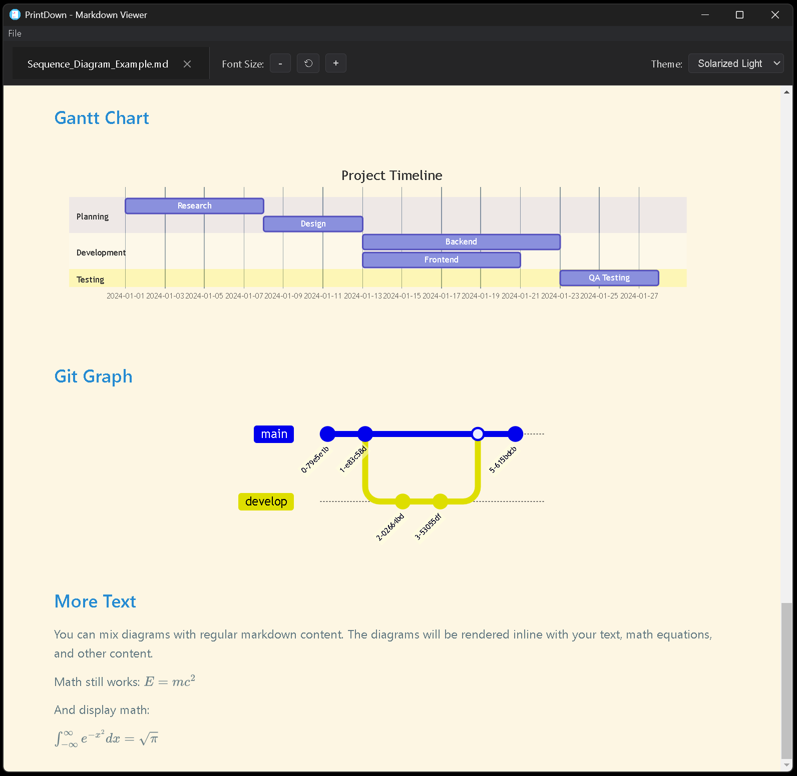
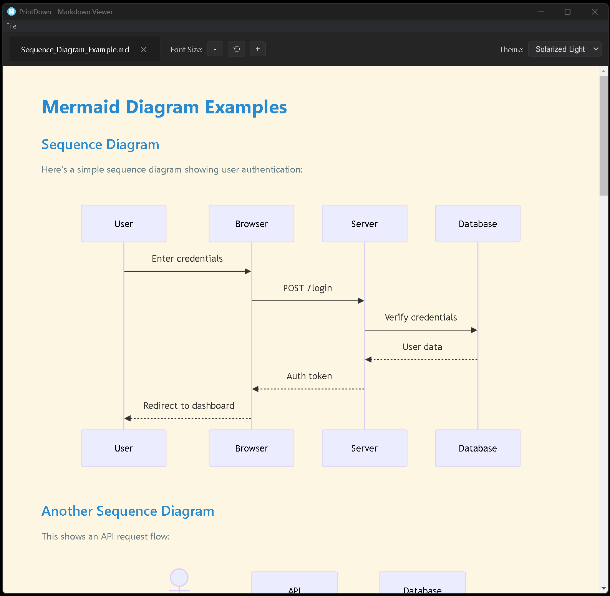
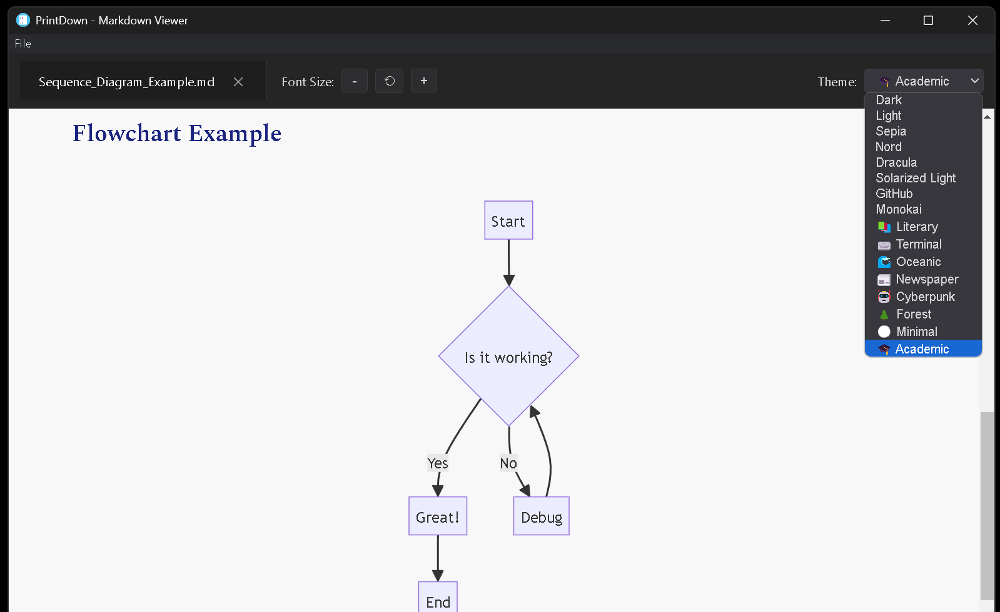
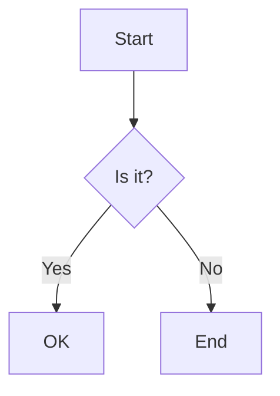

# PrintDown

Feature-rich Markdown viewer and PDF exporter built with Electron.

## Screenshots

### Mermaid Diagrams & Math Support

*Render Gantt charts, Git graphs, and mathematical equations seamlessly in your Markdown documents*

### Mermaid Sequence Diagrams

*Create professional sequence diagrams showing user authentication flows and API interactions*

### Multiple Themes

*Choose from 16+ beautiful themes including Dark, Light, Academic, and more*

## Features

### Markdown Support
- Live preview of Markdown files
- Support for CommonMark and GitHub Flavored Markdown
- Multiple file tabs for easy switching between documents

### Customizable Themes
Choose from 16+ themes *(see theme dropdown screenshot above)*:

### Math Equations
Full support for mathematical notation using **MathJax 3** *(see first screenshot above)*:
- **Inline math**: `$E = mc^2$` renders as $E = mc^2$
- **Display math**: Complex integrals like `$$\int_{-\infty}^{\infty} e^{-x^2} dx = \sqrt{\pi}$$`
- LaTeX commands and symbols
- Chemistry equations with mhchem
- Automatic rendering in both light and dark themes

### Diagrams
Render complex diagrams directly in your Markdown:

**Mermaid Diagrams** *(see screenshots above)*:
- **Flowcharts** - Decision trees and process flows
- **Sequence diagrams** - User authentication, API interactions
- **Class diagrams** - UML class structures
- **State diagrams** - State machines
- **Gantt charts** - Project timelines and schedules
- **Git graphs** - Repository branch visualization
- **Pie charts** - Data visualization

### Font Size Control
- Adjustable font size with +/- buttons
- Smooth scaling from 50% to 200%
- Reset button to return to default
- Persistent settings across sessions

### PDF Export
Export your Markdown to PDFs:

### Session Management
- Automatically saves open files
- Restores tabs on app restart
- Remembers theme and font size preferences

## Installation

Download the latest installer from the [Releases](https://github.com/nambatipudi/PrintDown/releases) page:

- **Windows**: `PrintDown-Setup-x.x.x.exe` - Run the installer and follow the wizard
- **macOS**: `PrintDown-x.x.x.dmg` - Open DMG and drag to Applications folder ([detailed guide](MACOS_INSTALLATION.md))
- **Linux**: `PrintDown-x.x.x.AppImage` - Make executable and run

### Quick Start
1. Download the appropriate installer for your platform
2. Install (drag to Applications on macOS, run installer on Windows)
3. Launch PrintDown
4. Drag and drop your `.md` files or use File → Open


## Usage

### Opening Files

PrintDown offers multiple convenient ways to open Markdown files:

1. **Drag and Drop** 
   - Simply drag `.md` or `.markdown` files from your file explorer
   - Drop them anywhere on the PrintDown window
   - Multiple files can be dropped at once (opens in separate tabs)
   - Visual feedback shows when files are ready to drop

2. **File Menu** (Ctrl/Cmd + O)
   - Click **File → Open**
   - Browse and select your Markdown file
   - Supports `.md` and `.markdown` extensions

3. **Double-Click** (optional)
   - If you enabled file association during installation
   - Double-click any `.md` file in your file explorer
   - Opens directly in PrintDown

4. **Command Line**
   - Launch with a file: `printdown myfile.md`
   - Opens the specified file on startup

### Adjusting Font Size
- Click **-** button to decrease
- Click **⟲** button to reset to default
- Click **+** button to increase

### Changing Themes
Select from the theme dropdown in the top-right corner.

### Exporting to PDF
- **File → Export to PDF** (Ctrl/Cmd + E)
- Choose save location
- PDF will be generated with current theme and font size

### Printing
- **File → Print** (Ctrl/Cmd + P)
- Use system print dialog
- Can save as PDF via print dialog

## Keyboard Shortcuts

| Action | Shortcut |
|--------|----------|
| Open File | `Ctrl/Cmd + O` |
| Print | `Ctrl/Cmd + P` |
| Export to PDF | `Ctrl/Cmd + E` |
| Exit | `Ctrl/Cmd + Q` |

## Markdown Examples

### Math Example
```markdown
Inline math: $E = mc^2$

Display math:
$$
\int_{-\infty}^{\infty} e^{-x^2} dx = \sqrt{\pi}
$$
```

### Mermaid Diagram Example
````markdown

````

### UML Sequence Diagram Example
````markdown
```uml-sequence-diagram
Alice->Bob: Hello Bob, how are you?
Note right of Bob: Bob thinks
Bob-->Alice: I am good thanks!
```
````

## License

This project is open source and available under the [MIT License](LICENSE).

## Author

**Nambatipudi**
- GitHub: [@nambatipudi](https://github.com/nambatipudi)

## Acknowledgments

- MathJax for mathematical typesetting
- Mermaid for diagram rendering
- Marked.js for Markdown parsing
- Electron community for the amazing framework

---
