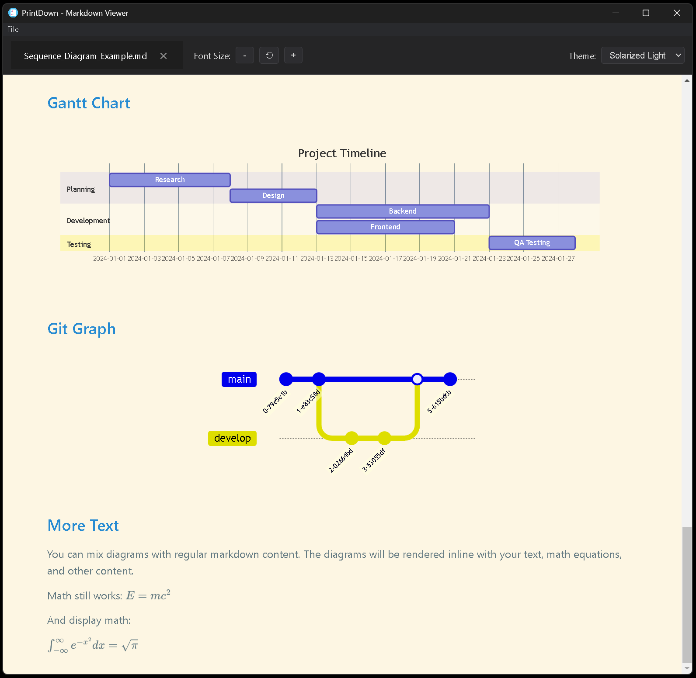
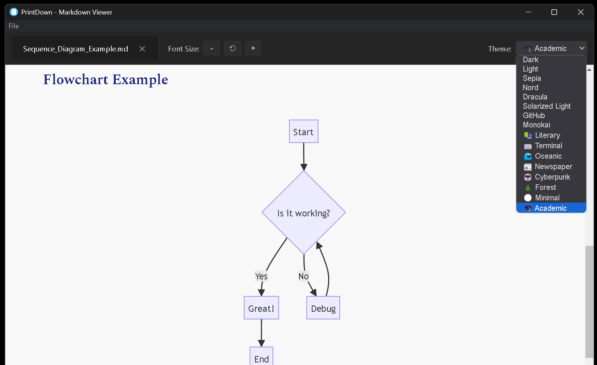
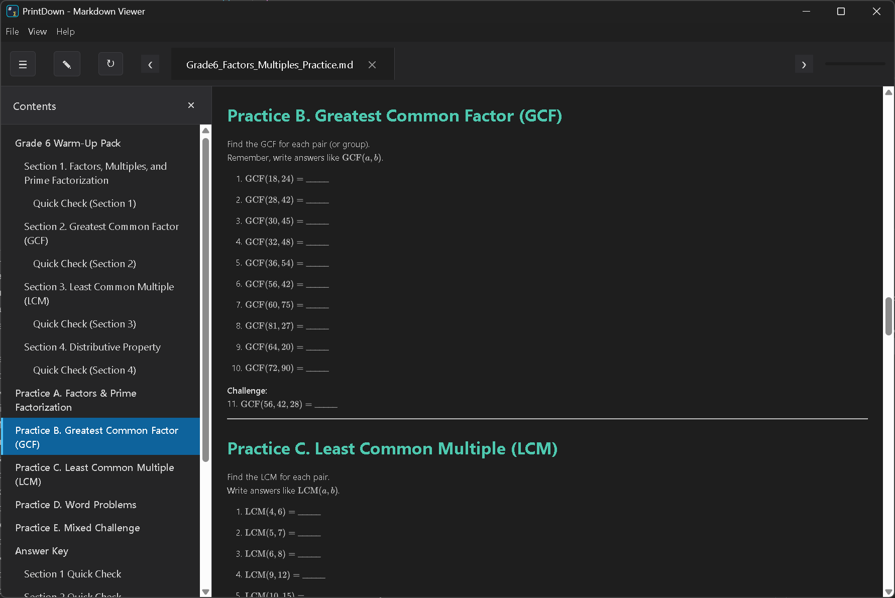
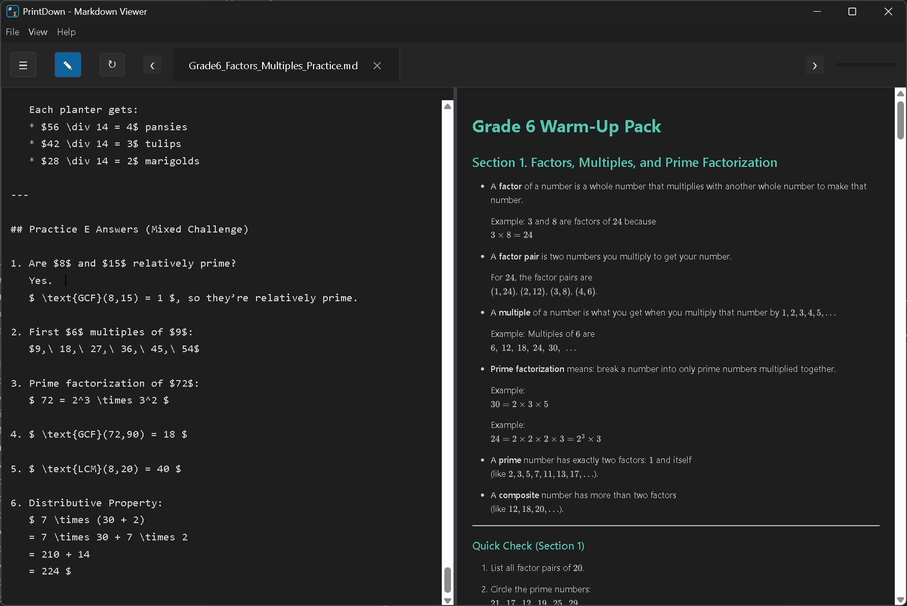
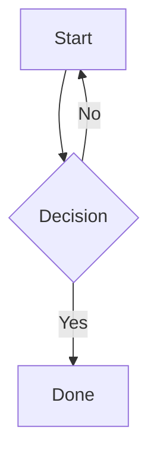

# PrintDown

A focused Markdown viewer and PDF exporter for desktop. Open `.md` files, read them beautifully, navigate with a table of contents, and export clean PDFs — all offline.

---

## Screenshots


*Mermaid diagrams, Gantt charts, and MathJax equations side-by-side*


*22 themes including print-optimized layouts*


*Collapsible TOC sidebar with active heading tracking*


*Split-pane edit mode with live preview*

---

## Installation

Download from the [Releases](https://github.com/nambatipudi/PrintDown/releases) page:

| Platform | File |
|----------|------|
| macOS | `PrintDown-x.x.x-mac-arm64.dmg` — open and drag to Applications |
| Windows | `PrintDown-Setup-x.x.x.exe` — run the installer |
| Linux | `PrintDown-x.x.x.AppImage` — make executable and run |

---

## Opening Files

- **Drag and drop** one or more `.md` files onto the window
- **File → Open...** (`Cmd/Ctrl+O`) to browse
- **Double-click** a `.md` file if you set up the file association during install

Multiple files open as tabs. Tabs can be scrolled with the `‹` `›` buttons when there are many. Right-click any tab for **Close**, **Close Others**, or **Close All**.

---

## Features

### Table of Contents

Click the **☰** button (top-left) or press `Cmd/Ctrl+\` to toggle the TOC sidebar. The sidebar lists every heading in the document — click one to scroll there instantly. The active section is highlighted as you scroll.

### Edit Mode

Click the **✎** button (or use the toolbar) to split the window into an editor on the left and a live preview on the right. The preview updates as you type. Drag the splitter to adjust the ratio.

### Themes

**View → Theme** offers 22 themes:

| General use | Print-optimized |
|-------------|-----------------|
| Dark, Light, Sepia, Nord | Print Classic |
| Dracula, Monokai, GitHub | Print Modern |
| Oceanic, Terminal, Forest | Print Elegant |
| Literary, Newspaper, Academic | Print Technical |
| Minimal, Cyberpunk, Solarized Light | Print Report |
| | Print Minimalist |

The six print-optimized themes are designed for clean PDF output with professional typography.

### Font Size

**View → Font Size** or keyboard shortcuts:

| Action | Shortcut |
|--------|----------|
| Increase | `Cmd/Ctrl+=` |
| Decrease | `Cmd/Ctrl+-` |
| Reset | `Cmd/Ctrl+0` |

Font size persists across sessions and is applied to PDF exports.

### Math Equations

Write LaTeX inline with `$...$` or display with `$$...$$`:

```markdown
Inline: $E = mc^2$

Display:
$$\int_{-\infty}^{\infty} e^{-x^2} dx = \sqrt{\pi}$$
```

Rendered by MathJax 3, fully offline.

### Mermaid Diagrams

Use a `mermaid` fenced code block for flowcharts, sequence diagrams, class diagrams, state diagrams, Gantt charts, Git graphs, and pie charts:

````markdown

```mermaid
graph TD
    A[Start] --> B{Decision}
    B -->|Yes| C[Done]
    B -->|No| A
```
````

Diagrams match the active theme automatically.

### Draw.io Diagrams

Paste the XML from [diagrams.net](https://app.diagrams.net) into an `xml` fenced code block:

````markdown
```xml
<mxGraphModel>
  <root>
    <mxCell id="0"/><mxCell id="1" parent="0"/>
    <mxCell id="2" value="Hello" style="rounded=1;" vertex="1" parent="1">
      <mxGeometry x="100" y="100" width="120" height="60" as="geometry"/>
    </mxCell>
  </root>
</mxGraphModel>
```
````

PrintDown renders it as SVG inline — no external service needed. Supports shapes, connectors, swimlanes, text labels, and custom styling.

### Images and SVG

Reference images normally in Markdown. SVG files are supported alongside PNG, JPG, GIF, and WebP. You can also embed raw `<svg>` tags directly in the document.

### Resize and Reposition

Hover over any image or Mermaid diagram to reveal handles:
- **Bottom-right corner** — drag to resize (aspect ratio preserved)
- **Top handle ⋮⋮** — drag to align left / center / right
- **Double-click** — reset to original size and position

Settings are saved per file and applied to PDF exports.

### PDF Export

**File → Export to PDF...** (`Cmd/Ctrl+P`) opens a save dialog. The PDF uses the current theme, font size, and all image/diagram layout settings.

For the cleanest output, switch to one of the **Print** themes before exporting.

### Page Settings

Click the **📄** button in the toolbar to set paper size (A4, Letter, A3, etc.), orientation, margins, and enable **Page View** — a paginated layout that shows how the document will break across pages before you export.

### File Watching

When a file open in a tab is modified externally, PrintDown detects the change. If the tab has no unsaved edits it reloads automatically; if it has edits it prompts you to keep or discard them.

### Session Restore

On next launch, PrintDown reopens the same files, restores the active theme and font size, and remembers whether the TOC sidebar was open.

---

## Keyboard Shortcuts

| Action | Shortcut |
|--------|----------|
| Open file | `Cmd/Ctrl+O` |
| Save | `Cmd/Ctrl+S` |
| Export to PDF | `Cmd/Ctrl+P` |
| Increase font | `Cmd/Ctrl+=` |
| Decrease font | `Cmd/Ctrl+-` |
| Reset font | `Cmd/Ctrl+0` |
| Toggle TOC | `Cmd/Ctrl+\` |
| Quit | `Cmd/Ctrl+Q` |

---

## Supported Markdown

- CommonMark + GitHub Flavored Markdown (tables, strikethrough, task lists)
- Inline and display math (`$...$`, `$$...$$`)
- Mermaid diagrams (fenced ` ```mermaid ` blocks)
- Draw.io diagrams (fenced ` ```xml ` blocks containing `<mxGraphModel>`)
- Inline HTML and SVG
- Footnotes, definition lists, code syntax highlighting

---

## License

[MIT](LICENSE) — © Narayan Ambatipudi
