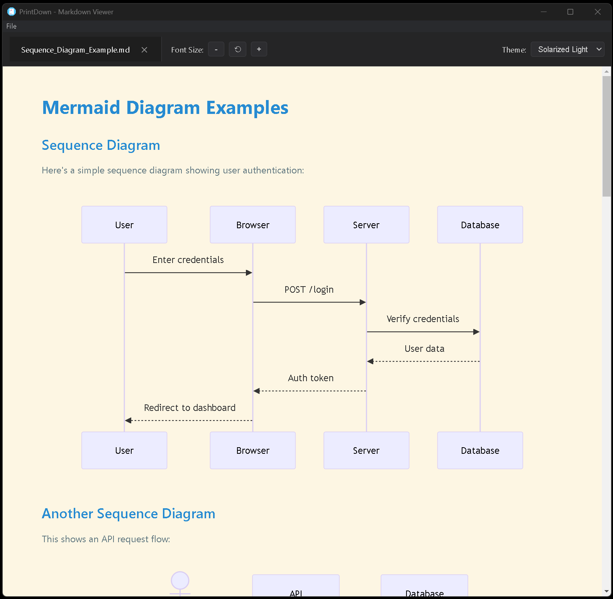
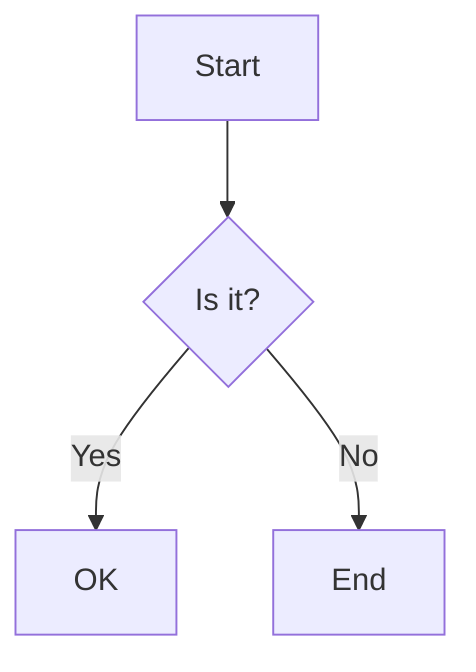

# PrintDown

Feature-rich Markdown viewer and PDF exporter built with Electron.

## Screenshots

### Mermaid Diagrams & Math Support

*Render Gantt charts, Git graphs, and mathematical equations seamlessly in your Markdown documents*

### Mermaid Sequence Diagrams

*Create professional sequence diagrams showing user authentication flows and API interactions*

### Multiple Themes

*Choose from 16+ beautiful themes including Dark, Light, Academic, and more*

## Features

### Markdown Support
- Live preview of Markdown files
- Support for CommonMark and GitHub Flavored Markdown
- Multiple file tabs for easy switching between documents
- **NEW: Table of Contents (TOC) Sidebar** - Navigate long documents with collapsible heading tree

### Navigation & Interface
- **Collapsible TOC Sidebar** - Click the ☰ hamburger button to toggle
- **Smart heading navigation** - Click any heading in TOC to scroll smoothly
- **Active section highlighting** - Current section highlighted in TOC
- **Tab scrolling** (NEW) - Left/right scroll buttons (‹ ›) for many open tabs
- **Keyboard shortcuts** - Ctrl/Cmd + \ to toggle TOC
- **Right-click tab context menu** - Close, Close Others, Close All options
- **Enhanced drag & drop** - Visual feedback and multi-file support with drop zones

### Customizable Themes
Choose from **22 beautiful themes** including 6 print-optimized options:

**General Use Themes (16)**:
- `dark`, `light`, `sepia`, `nord`, `dracula`, `solarized-light`
- `github`, `monokai`, `literary`, `terminal`, `oceanic`, `newspaper`
- `cyberpunk`, `forest`, `minimal`, `academic`

**Print-Optimized Themes (6)** - Professional layouts for PDF export:
- `print-classic` - Traditional serif with warm tones
- `print-modern` - Clean sans-serif with blue accents
- `print-elegant` - Refined purple palette with Palatino
- `print-technical` - Technical documentation with green accents
- `print-report` - Professional reports with gold highlights
- `print-minimalist` - Minimalist red accents

### Math Equations
Full support for mathematical notation using **MathJax 3** *(see first screenshot above)*:
- **Inline math**: `$E = mc^2$` renders as $E = mc^2$
- **Display math**: Complex integrals like `$$\int_{-\infty}^{\infty} e^{-x^2} dx = \sqrt{\pi}$$`
- LaTeX commands and symbols
- Chemistry equations with mhchem
- Automatic rendering in both light and dark themes

### Diagrams
Render complex diagrams directly in your Markdown with full customization:

**Mermaid Diagrams** *(see screenshots above)*:
- **Flowcharts** - Decision trees and process flows
- **Sequence diagrams** - User authentication, API interactions
- **Class diagrams** - UML class structures
- **State diagrams** - State machines
- **Gantt charts** - Project timelines and schedules
- **Git graphs** - Repository branch visualization
- **Pie charts** - Data visualization

**Diagram Customization** (NEW in v1.7.0):
- **Resizable** - Drag the resize handle at bottom-right corner
- **Repositionable** - Drag the top handle (⋮⋮) to align left/center/right
- **Theme-Aware** - Diagrams automatically match all 22 PrintDown themes
- **Persistent Settings** - Size and position saved per diagram
- **Double-click to Reset** - Quickly restore original size and position
- **PDF-Ready** - Handles hidden in PDF exports for clean output

### Font Size Control
- Adjustable font size with +/- buttons
- Smooth scaling from 50% to 200%
- Reset button to return to default
- Persistent across sessions and respected by PDF export

### Image & SVG Support
- **Multiple image formats**: PNG, JPG, GIF, WebP, and **SVG**
- **External SVG files**: Reference SVG files using `` syntax
- **Inline SVG**: Embed SVG code directly in your Markdown (HTML support enabled)
- **Per-image resizing**: Hover to see handle, drag to resize, double-click to reset
- **Repositionable images** (NEW): Drag the top handle (⋮⋮) to align left/center/right
- **Aspect ratio preservation**: Images maintain proportions when resized
- **Persistent settings**: Sizes and positions persist per file and are honored by PDF export

### PDF Export
Export your Markdown to PDFs:

### Performance & Reliability
- **Completely offline** - No CDN dependencies, works without internet
- **Local vendor scripts** - MathJax, Mermaid, and all libraries bundled locally
- **System fonts** - Uses high-quality system fonts (no Google Fonts dependency)
- **Electron 39** - Latest Electron with modern security and performance
- **File watching** - Automatically detects external changes to open files
- **Zero vulnerabilities** - All dependencies updated and security issues resolved

### Session Management
- Automatically saves open files
- Restores tabs on app restart
- Remembers theme and font size preferences
- **TOC state persistence** - Remembers if sidebar was open/closed
- **File watching** - Detects external changes to open files and prompts to reload
- **Visual customization persistence** - Saves image/diagram sizes and positions per file

## What's New in v1.7.1 🎉

### Latest Updates (v1.7.0 - v1.7.1):
- **📐 Resizable & Repositionable Diagrams** - Resize and reposition Mermaid diagrams just like images
- **🎨 Enhanced Mermaid Theming** - Diagrams now match all 22 PrintDown theme colors automatically
- **🗂️ Tab Scrolling** - Navigate many open tabs with left/right scroll buttons (‹ ›)
- **🔧 Drag-Drop Improvements** - Enhanced visual feedback and better multi-file support
- **🧹 Performance Optimizations** - Cleaned up debug logging for faster rendering

### Recent Additions (v1.4.0 - v1.6.0):
- **🖨️ Print-Friendly Themes** - 6 new themes optimized for PDF export: `print-classic`, `print-modern`, `print-elegant`, `print-technical`, `print-report`, `print-minimalist`
- **📄 Enhanced PDF Export** - Fixed truncation issues, hidden TOC from PDFs, improved generation performance
- **➕ Improved Math Rendering** - Better support for inline math with spaces (e.g., `$ (a + b) $`)
- **📚 Markdown-it Migration** - Switched from marked.js to markdown-it with texmath plugin for better math rendering
- **⬆️ Latest Dependencies** - Electron 39, Mermaid 11.12.1, Webpack 5.102.1, all security vulnerabilities fixed
- **🔒 Security Enhancements** - Added CSP headers and improved error handling

### Foundation (v1.3.0):
- **🧭 Table of Contents Sidebar** - Navigate long documents with collapsible heading tree
- **⚡ Completely Offline** - Removed all CDN dependencies for true offline functionality
- **🔧 Enhanced UI** - Moved font/theme controls to main menu for cleaner interface
- **🖱️ Tab Context Menu** - Right-click tabs for Close, Close Others, Close All options
- **📝 Per-Image Resizing** - Resize individual images with drag handles and aspect ratio preservation

### Technical Improvements:
- Local vendor scripts (MathJax, Mermaid, Raphael, Underscore)
- System font stacks instead of Google Fonts
- Enhanced session restoration with file watching
- Improved drag & drop handling with visual feedback
- Better error handling and debugging
- VS Code debug configurations included

## Installation

Download the latest installer from the [Releases](https://github.com/nambatipudi/PrintDown/releases) page:

- **Windows**: `PrintDown-Setup-x.x.x.exe` - Run the installer and follow the wizard
- **macOS**: `PrintDown-x.x.x.dmg` - Open DMG and drag to Applications folder ([detailed guide](MACOS_INSTALLATION.md))
- **Linux**: `PrintDown-x.x.x.AppImage` - Make executable and run

### Quick Start
1. Download the appropriate installer for your platform
2. Install (drag to Applications on macOS, run installer on Windows)
3. Launch PrintDown
4. Drag and drop your `.md` files or use File → Open


## Usage

### Opening Files

PrintDown offers multiple convenient ways to open Markdown files:

1. **Drag and Drop** 
   - Simply drag `.md` or `.markdown` files from your file explorer
   - Drop them anywhere on the PrintDown window
   - Multiple files can be dropped at once (opens in separate tabs)
   - Visual feedback shows when files are ready to drop

2. **File Menu** (Ctrl/Cmd + O)
   - Click **File → Open**
   - Browse and select your Markdown file
   - Supports `.md` and `.markdown` extensions

3. **Double-Click** (optional)
   - If you enabled file association during installation
   - Double-click any `.md` file in your file explorer
   - Opens directly in PrintDown

4. **Command Line**
   - Launch with a file: `printdown myfile.md`
   - Opens the specified file on startup

### Adjusting Font Size
- Click **-** button to decrease
- Click **⟲** button to reset to default
- Click **+** button to increase

### Resizing & Positioning Images and Diagrams
- **Resize**: Hover to reveal resize handle at bottom-right corner, drag to resize (aspect ratio preserved)
- **Reposition**: Hover to reveal drag handle (⋮⋮) at top, drag to align left/center/right
- **Reset**: Double-click to restore original size and position
- **Persistent**: Your choices are remembered per file and used during PDF export
- **Works for**: Both images (PNG, JPG, SVG, etc.) and Mermaid diagrams

### Using Table of Contents (NEW!)
- Click the **☰ hamburger button** (top-left) to open/close TOC sidebar
- Or use **View → Toggle Table of Contents** from the menu
- Or press **Ctrl/Cmd + \\** keyboard shortcut
- Click any heading in the TOC to navigate smoothly to that section
- Current section is highlighted automatically as you scroll

### Changing Themes
Use **View → Theme** from the menu to choose from 16+ beautiful themes.

### Exporting to PDF
- **File → Export to PDF** (Ctrl/Cmd + E)
- Choose save location
- PDF will be generated with current theme and font size

### Printing
- **File → Print** (Ctrl/Cmd + P)
- Use system print dialog
- Can save as PDF via print dialog

## Keyboard Shortcuts

| Action | Shortcut |
|--------|----------|
| Open File | `Ctrl/Cmd + O` |
| Print | `Ctrl/Cmd + P` |
| Export to PDF | `Ctrl/Cmd + E` |
| **Toggle TOC Sidebar** | `Ctrl/Cmd + \` |
| **Increase Font Size** | Available in View menu |
| **Decrease Font Size** | Available in View menu |
| **Reset Font Size** | Available in View menu |
| Exit | `Ctrl/Cmd + Q` |

## Why PrintDown (vs. VS Code Preview)

- **Professional Navigation**: Built-in Table of Contents sidebar with smooth scrolling and active section highlighting
- **Better Math Rendering**: Enhanced MathJax pipeline with markdown-it-texmath for improved parenthetical expressions and consistent spacing
- **Visual Customization**: Resize AND reposition images and Mermaid diagrams with drag handles. Settings persist and apply to PDF output
- **Enhanced Diagrams**: Built-in Mermaid support with automatic theme matching across 22 themes; no extensions required
- **Print & Export**: First-class PDF export with 6 print-optimized themes, respecting all visual customizations and font sizes
- **Tabs & Management**: Multi-tab viewer with scrolling navigation and right-click context menu (Close, Close Others, Close All)
- **Completely Offline**: Zero CDN dependencies - works without internet connection
- **Modern Architecture**: Electron 39 with latest security features, zero vulnerabilities, and file watching
- **Performance & Focus**: A dedicated viewer focused on reading/printing Markdown with less editor overhead

## SVG Support

PrintDown fully supports SVG (Scalable Vector Graphics) in two ways:

### 1. External SVG Files
Reference SVG files using standard Markdown image syntax:
```markdown

```

### 2. Inline SVG (Raw HTML)
Embed SVG code directly in your Markdown:
```markdown
<svg width="100" height="100">
  <circle cx="50" cy="50" r="40" fill="#4CAF50" />
</svg>
```

See `Test_Files/SVG_Support_Test.md` for comprehensive examples including:
- External SVG file loading
- Inline SVG with gradients
- Animated SVG
- Data URI SVG

## Markdown Examples

### Math Example
```markdown
Inline math: $E = mc^2$

Display math:
$$
\int_{-\infty}^{\infty} e^{-x^2} dx = \sqrt{\pi}
$$
```

### Mermaid Diagram Example
````markdown

```mermaid
graph TD
    A[Start] --> B{Is it?}
    B -->|Yes| C[OK]
    B -->|No| D[End]
```
````

### UML Sequence Diagram Example
````markdown
```uml-sequence-diagram
Alice->Bob: Hello Bob, how are you?
Note right of Bob: Bob thinks
Bob-->Alice: I am good thanks!
```
````

### Draw.io Diagram Example

PrintDown now supports embedded Draw.io XML diagrams. You can draw professional diagrams in draw.io and embed them directly in your markdown files:

````markdown
```xml
<mxGraphModel dx="800" dy="600" grid="0" gridSize="10" guides="1" tooltips="1" connect="1" arrows="1" fold="1" page="0" pageScale="1" pageWidth="1169" pageHeight="827" math="0" shadow="0">
  <root>
    <mxCell id="0"/>
    <mxCell id="1" parent="0"/>
    <mxCell id="2" value="Start" style="ellipse;whiteSpace=wrap;html=1;" vertex="1" parent="1">
      <mxGeometry x="350" y="20" width="80" height="80" as="geometry"/>
    </mxCell>
    <!-- ... more diagram elements ... -->
  </root>
</mxGraphModel>
```
````

**Features:**
- Automatic SVG rendering of Draw.io XML diagrams (no external dependencies required)
- Real-time visualization of flowcharts, architecture diagrams, and more
- "✎ Edit in Draw.io" button to open diagrams in the online editor
- "📋 Copy XML" button to copy diagram content
- Full PDF export support with proper SVG embedding

**Supported diagram elements:**
- Rectangles with optional rounded corners
- Ellipses and circles
- Diamond shapes (rhombus) for decision points
- Connecting edges with arrows
- Text labels on shapes
- Custom colors and styling

**How to create Draw.io diagrams:**
1. Go to https://app.diagrams.net/
2. Create your diagram using shapes, connectors, and text
3. Click "Extras → Edit Diagram" to get the XML
4. Copy the entire `<mxGraphModel>` XML block
5. Wrap in a markdown code block with `xml` language tag
6. Embed in your markdown file

See [Draw.io_Diagram_Example.md](Test_Files/Draw.io_Diagram_Example.md) for complete examples.

## License

This project is open source and available under the [MIT License](LICENSE).

## Author

**Nambatipudi**
- GitHub: [@nambatipudi](https://github.com/nambatipudi)

## Acknowledgments

- MathJax for mathematical typesetting
- Mermaid for diagram rendering
- markdown-it and markdown-it-texmath for Markdown parsing with math support
- CodeMirror for inline Markdown editing
- Electron community for the amazing framework

---
