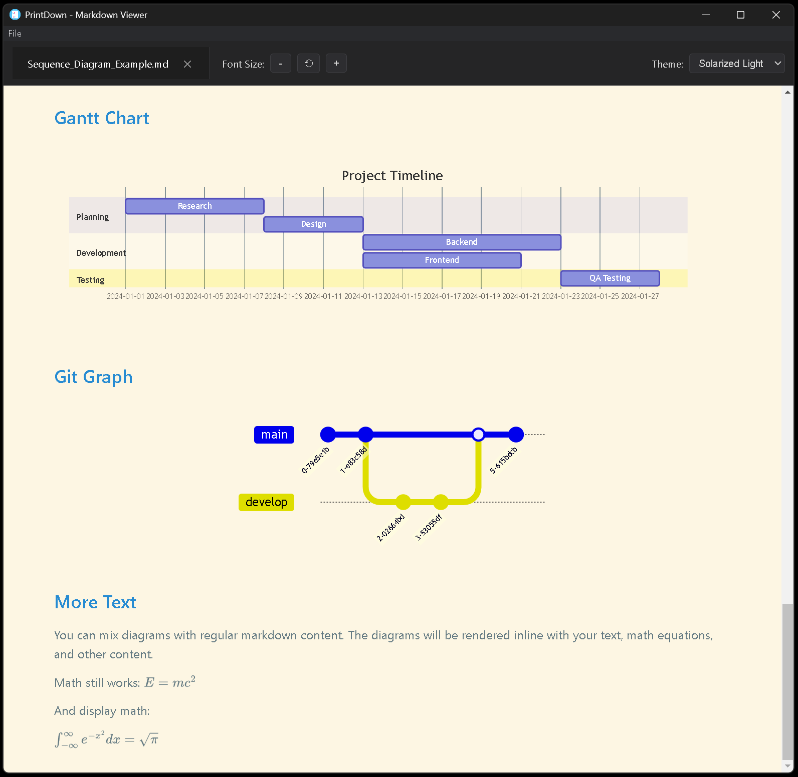
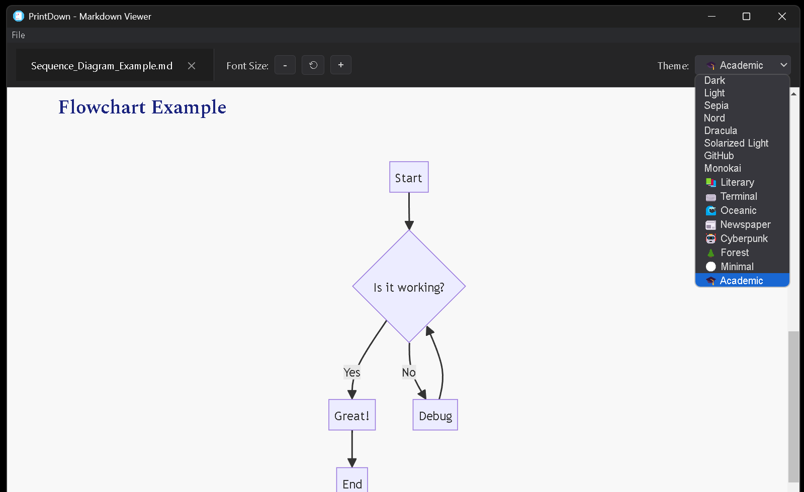
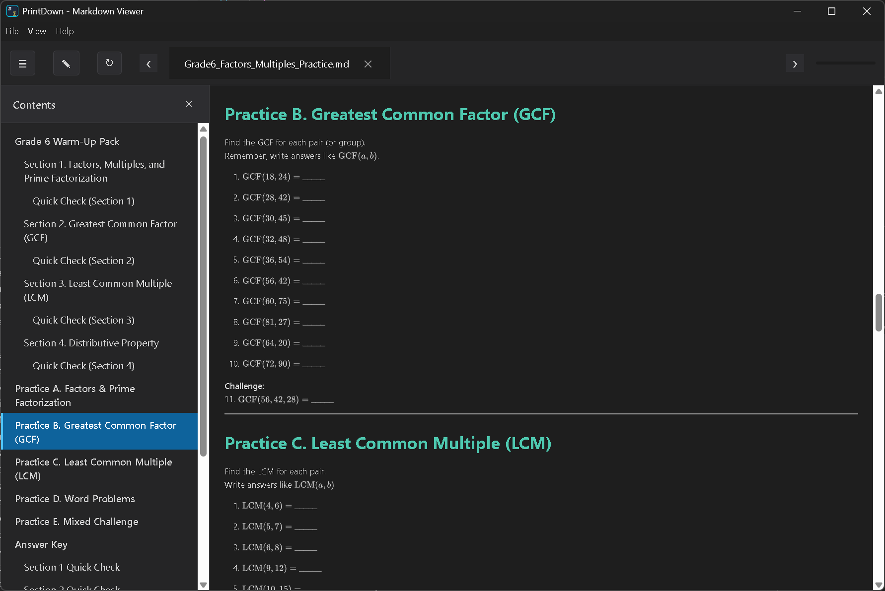
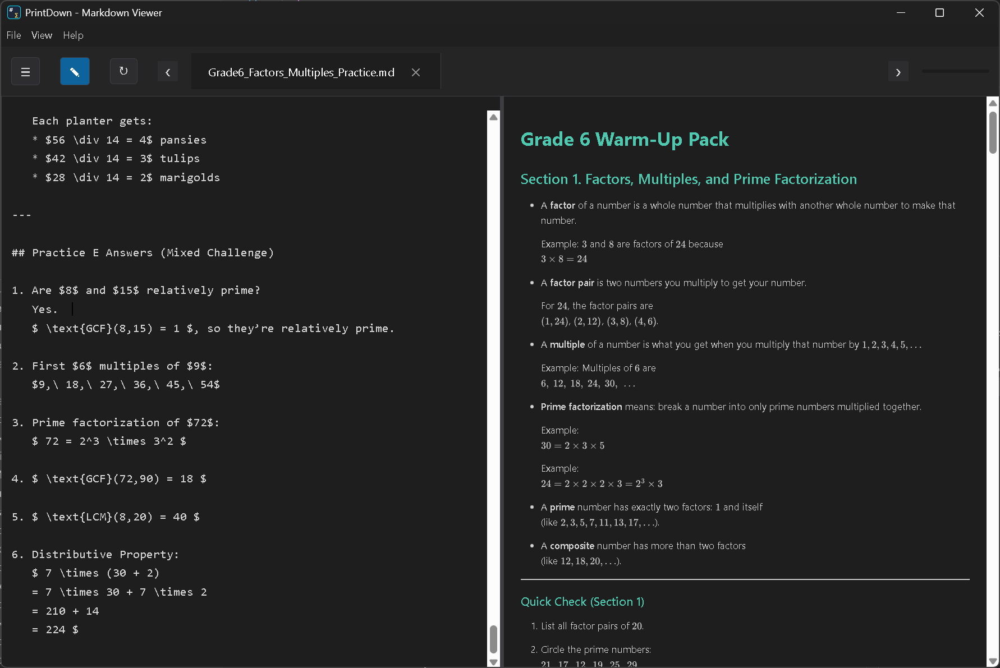
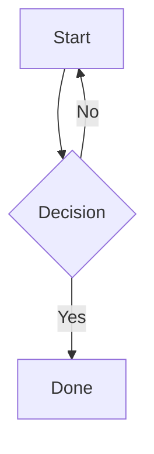

# PrintDown

A focused Markdown reader, editor, and PDF exporter for desktop. Open `.md` files, read them in a distraction-free layout, make changes with a live preview, and export clean PDFs — all offline.

---

## Screenshots


*Mermaid diagrams, Gantt charts, and MathJax equations side-by-side*


*28 themes including modern, retro, and print-optimized palettes*


*Collapsible TOC sidebar with active heading tracking*


*Split-pane edit mode with live preview*

---

## Installation

Download the asset that matches your platform from the [Releases](https://github.com/nambatipudi/PrintDown/releases) page. Available installers vary by release:

| Platform | File |
|----------|------|
| macOS (Apple Silicon) | `Print Down-x.x.x-mac-arm64.dmg` — open and drag to Applications |
| Windows | `Print Down Setup x.x.x.exe` — run the installer when available |
| Linux | `Print Down-x.x.x.AppImage` — make executable and run when available |

---

## Opening Files

- **Drag and drop** one or more `.md` files onto the window
- **File → Open...** (`Cmd/Ctrl+O`) to browse
- **Double-click** a `.md` file if you set up the file association during install

Multiple files open as tabs. Tabs can be scrolled with the `‹` `›` buttons when there are many. Right-click any tab for **Close**, **Close Others**, or **Close All**. Closing tabs with unsaved work prompts you to save all changes, discard them, or cancel; closing other tabs also cleans up their file watchers and directory access.

---

## Features

### Table of Contents

Click the **☰** button (top-left) or press `Cmd/Ctrl+\` to toggle the TOC sidebar. The sidebar lists every heading in the document — click one to scroll there instantly. The active section is highlighted as you scroll.

### Edit Mode

Click the **✎** button (or use the toolbar) to split the window into an editor on the left and a live preview on the right. The preview updates as you type. Drag the splitter to adjust the ratio.

### Themes

**View → Theme** offers 28 themes:

| General use | Curated palettes | Print-optimized |
|-------------|------------------|-----------------|
| Dark, Light, Sepia, Nord | Modern Slate, Modern Sage | Print Classic |
| Dracula, Monokai, GitHub | Modern Rose, Retro Amber | Print Modern |
| Oceanic, Terminal, Forest | Retro Sunset, Retro Pixel | Print Elegant |
| Literary, Newspaper, Academic | | Print Technical |
| Minimal, Cyberpunk, Solarized Light | | Print Report |
| | | Print Minimalist |

The six print-optimized themes are designed for clean PDF output with professional typography. The modern palettes use neutral surfaces with a single accent hue to preserve hierarchy and reading contrast. The retro palettes use deliberately limited amber, sunset, and phosphor-inspired colors rather than saturating the whole page; body and code text remain high-contrast for long reading sessions.

### Font Size

**View → Font Size** or keyboard shortcuts:

| Action | Shortcut |
|--------|----------|
| Increase | `Cmd/Ctrl+=` |
| Decrease | `Cmd/Ctrl+-` |
| Reset | `Cmd/Ctrl+0` |

Font size persists across sessions and is applied to PDF exports.

### Math Equations

Write LaTeX inline with `$...$` or display with `$$...$$`:

```markdown
Inline: $E = mc^2$

Display:
$$\int_{-\infty}^{\infty} e^{-x^2} dx = \sqrt{\pi}$$
```

Rendered by MathJax 3, fully offline.

### Mermaid Diagrams

Use a `mermaid` fenced code block for flowcharts, sequence diagrams, class diagrams, state diagrams, Gantt charts, Git graphs, and pie charts:

````markdown

```mermaid
graph TD
    A[Start] --> B{Decision}
    B -->|Yes| C[Done]
    B -->|No| A
```
````

Diagrams match the active theme automatically.

### Draw.io Diagrams

Paste the XML from [diagrams.net](https://app.diagrams.net) into an `xml` fenced code block:

````markdown
```xml
<mxGraphModel>
  <root>
    <mxCell id="0"/><mxCell id="1" parent="0"/>
    <mxCell id="2" value="Hello" style="rounded=1;" vertex="1" parent="1">
      <mxGeometry x="100" y="100" width="120" height="60" as="geometry"/>
    </mxCell>
  </root>
</mxGraphModel>
```
````

PrintDown renders it as SVG inline — no external service needed. Supports shapes, connectors, swimlanes, text labels, and custom styling.

### Images and SVG

Reference images normally in Markdown. SVG files are supported alongside PNG, JPG, GIF, and WebP. You can also embed raw `<svg>` tags directly in the document.

### Resize and Reposition

Hover over any image or Mermaid diagram to reveal handles:
- **Bottom-right corner** — drag to resize (aspect ratio preserved)
- **Top handle ⋮⋮** — drag to align left / center / right
- **Double-click** — reset to original size and position

Settings are saved per file and applied to PDF exports.

### PDF Export

**File → Export to PDF...** (`Cmd/Ctrl+P`) opens a save dialog. The PDF uses the current theme, font size, and all image/diagram layout settings.

For the cleanest output, switch to one of the **Print** themes before exporting.

### Page Settings

Click the **📄** button in the toolbar to set paper size (**A4, A3, Letter, Legal, or Custom**), orientation, margins, and enable **Page View** — a paginated layout that shows how the document will break across pages before you export. The same dimension model is used by Page View, page guides, page breaks, and PDF export.

### File Watching

When a file open in a tab is modified externally, PrintDown detects the change. If the tab has no unsaved edits it reloads automatically; if it has edits it prompts you to keep or discard them.

### Session Restore

On next launch, PrintDown reopens the same files, restores the active theme and font size, and remembers whether the TOC sidebar was open.

### Privacy and Safety

PrintDown processes Markdown, diagrams, equations, and PDF export locally. It sanitizes rendered Markdown HTML before inserting it into the application, while retaining the SVG and MathML elements required for Mermaid, Draw.io, and MathJax output.

---

## Keyboard Shortcuts

| Action | Shortcut |
|--------|----------|
| Open file | `Cmd/Ctrl+O` |
| Save | `Cmd/Ctrl+S` |
| Export to PDF | `Cmd/Ctrl+P` |
| Increase font | `Cmd/Ctrl+=` |
| Decrease font | `Cmd/Ctrl+-` |
| Reset font | `Cmd/Ctrl+0` |
| Toggle TOC | `Cmd/Ctrl+\` |
| Quit | `Cmd/Ctrl+Q` |

---

## Supported Markdown

- CommonMark + GitHub Flavored Markdown (tables, strikethrough, task lists)
- Inline and display math (`$...$`, `$$...$$`)
- Mermaid diagrams (fenced ` ```mermaid ` blocks)
- Draw.io diagrams (fenced ` ```xml ` blocks containing `<mxGraphModel>`)
- Inline HTML and SVG
- Footnotes, definition lists, code syntax highlighting

---

## Development and Quality Checks

Install dependencies with `npm ci`, then use:

| Command | Purpose |
|---------|---------|
| `npm run build` | Build production bundles |
| `npm run pack` | Build and package the macOS application directory |
| `npm run test:e2e` | Package the app and run the complete Playwright Electron regression suite |
| `npx tsc --noEmit` | Type-check the application |
| `npm audit --omit=dev` | Check production dependency advisories |

The E2E suite runs the packaged Electron app and covers file operations, tabs and unsaved changes, editing, rendering, MathJax, Mermaid, Draw.io, Page View, PDF export, themes, session restore, keyboard controls, accessibility state, and visual regressions.

## Releases

Version tags in the form `vX.Y.Z` trigger the macOS release workflow. It builds the installer, uploads the resulting artifacts, and creates the GitHub release. The manual build workflow can produce Windows and Linux artifacts when needed.

See [CHANGELOG.md](CHANGELOG.md) for release history.

---

## License

[MIT](LICENSE) — © Narayan Ambatipudi
