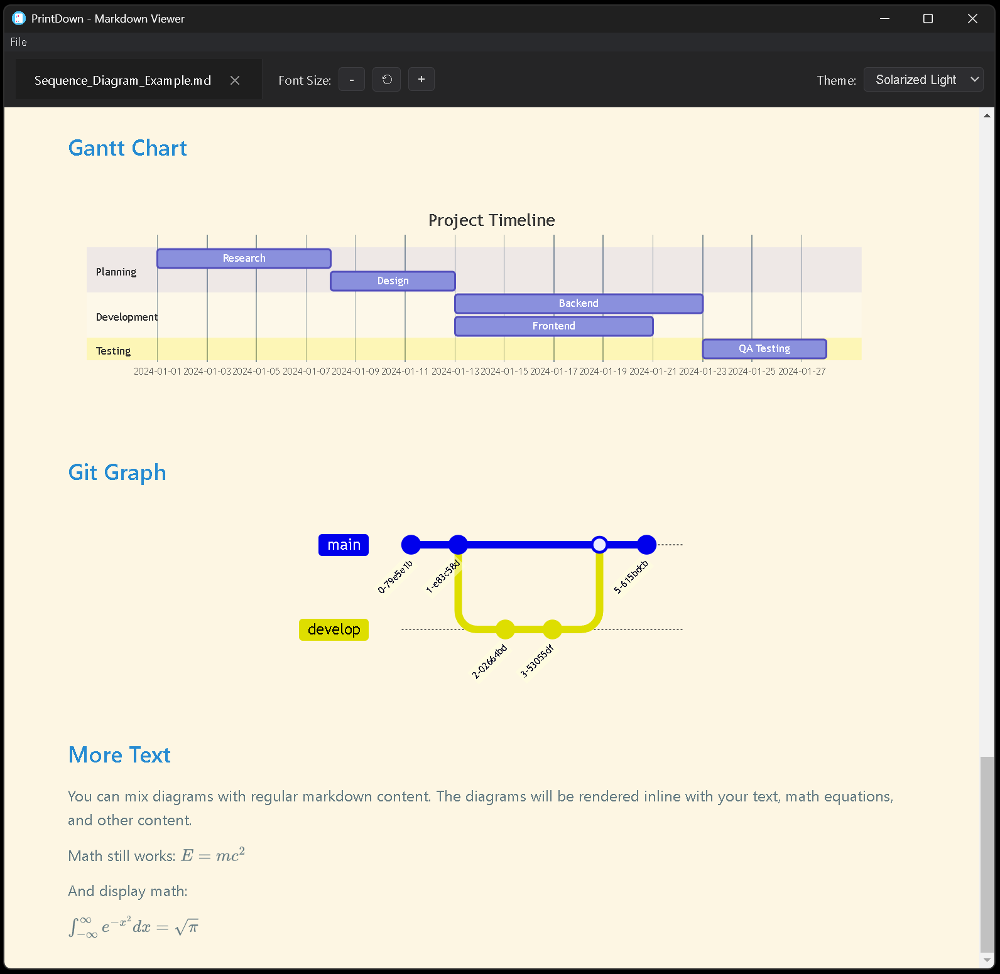

# Print Down

Print Down is an offline desktop Markdown reader, editor, and PDF exporter.
It renders documents with MathJax, Mermaid, Draw.io, SVG, images, themes, and
print-aware page settings—without sending document content to a web service.



---

## Install

Download the current platform artifact from
[GitHub Releases](https://github.com/nambatipudi/PrintDown/releases).

| Platform | Recommended artifact | Installation |
|:---------|:---------------------|:-------------|
| macOS — Apple Silicon | `Print-Down-x.x.x-mac-arm64.pkg` | Run the package installer. It installs Print Down in Applications and the Finder PDF-conversion Quick Action. |
| macOS — Apple Silicon | `Print-Down-x.x.x-mac-arm64.dmg` | Drag Print Down to Applications. The DMG includes the optional Quick Action workflow. |
| Windows | `Print-Down-Setup-x.x.x.exe` | Run the installer. It adds the Explorer **Convert to PDF (Markdown)** command for `.md` and `.markdown` files. |
| Linux | `Print-Down-x.x.x.AppImage` | Make the AppImage executable, then run it. |

> **macOS Quick Action:** The PKG is the one-step installer. After
> installation, relaunch Finder if needed, then use **Quick Actions → Convert
> Markdown to PDF** on one or more Markdown files.

---

## Start reading and editing

Open files with **File → Open…** (`Cmd/Ctrl+O`), drag files onto the window,
or open an associated Markdown file from Finder or Explorer.

### Documents and tabs

- Open one or many `.md` or `.markdown` files in tabs.
- Use the `‹` and `›` tab controls when many tabs are open.
- Right-click a tab for **Close**, **Close Others**, or **Close All**.
- Closing dirty tabs prompts you to **Save All**, discard changes, or cancel.
- Print Down restores open files, the active theme, font size, and the active
  document when it starts again.

### Reader and editor

The reader uses a centered, document-first layout. Select **Edit** to open a
split-pane Markdown editor with a live preview. Drag the splitter to adjust
the workspace, and use **Refresh** to reload a file that changed outside the
app.

### Navigate long documents

Use **View → Toggle Table of Contents** (`Cmd/Ctrl+\`) to show headings.
Click an entry to jump to it; the active heading follows the reader scroll.

---

## Create compatible Markdown

Print Down supports portable, print-friendly Markdown rather than a
proprietary document format.

### Core formatting

- One document title: begin with a single `# Heading`.
- Hierarchical headings: do not skip heading levels.
- Standard emphasis, links, ordered and unordered lists, nested lists,
  task lists, tables, blockquotes, and horizontal rules.
- Fenced code blocks with a language identifier, such as ` ```typescript `.
- Inline code with backticks and strikethrough with `~~text~~`.

### Math, diagrams, and visuals

| Content | Write it as |
|:--------|:------------|
| Inline math | `$E = mc^2$` |
| Display math | `$$\int_0^\infty e^{-x}\,dx = 1$$` |
| Mermaid diagram | A fenced `mermaid` block |
| Draw.io diagram | A fenced `xml` block containing `<mxGraphModel>` |
| UML sequence diagram | A fenced `uml-sequence-diagram` block |
| Inline SVG | A standalone `<svg>` element or `svg` fenced block |
| Image | Standard Markdown image syntax with a relative or supported URL |

MathJax renders mathematics locally. Mermaid supports flowcharts, sequence,
class, state, Gantt, Git graph, and pie diagrams. Draw.io XML is rendered
inline using diagrams.net technology.

### Images and print layout

PNG, JPG, GIF, WebP, and SVG images are supported. Relative paths resolve
from the Markdown file, so they travel well with a document folder. Hover an
image or Mermaid diagram to resize it, reposition it left/center/right, or
double-click it to reset its layout.

For predictable A4 output, keep images below approximately 186 mm wide, code
lines below roughly 100 characters, and complex diagrams below approximately
220 mm tall.

### Safe HTML and unsupported syntax

Safe presentation HTML includes `div`, `span`, `details`, `summary`, `table`,
`img`, `br`, `sup`, `sub`, `mark`, `kbd`, `abbr`, `p`, `ul`, `ol`, and `li`.
Scripts, event attributes, and `javascript:` URLs are removed before content
is rendered.

Avoid footnotes, definition lists, `[toc]` directives, emoji shortcodes,
admonition-block syntax, and relying on code syntax colors. They are not
supported consistently in Print Down’s reader and PDF output.

### Use AI authoring templates

Give an AI assistant the Print Down authoring rules before asking it to create
Markdown:

| Assistant | Copy this template into your content project |
|:----------|:---------------------------------------------|
| GitHub Copilot | [copilot-instructions.md](./templates/ai-instructions/copilot-instructions.md) → `.github/copilot-instructions.md` |
| Claude Code | [CLAUDE.md](./templates/ai-instructions/CLAUDE.md) → `CLAUDE.md` |

The templates guide AI-generated content toward supported Markdown, diagrams,
math, safe HTML, and printable layouts.

---

## Export and conversion

### Export the open document

Choose **File → Export to PDF…** (`Cmd/Ctrl+P`). The export uses the active
theme, font size, page settings, image/diagram layout, and rendered math.

#### Configure pages

Open **Page Setup** (the `📄` toolbar button) to choose:

- A4, A3, Letter, Legal, or a custom page size
- Portrait or landscape orientation
- Individual page margins
- Page View, which previews page width, margins, guides, and breaks before
  export

The same page-dimension model drives Page View and PDF export.

#### Choose a print theme

**View → Theme** includes 28 themes: general reading themes, six curated
modern/retro palettes, and six print-oriented themes. Use one of the **Print**
themes for restrained, professional PDF output.

##### Print theme options

- Print Classic
- Print Modern
- Print Elegant
- Print Technical
- Print Report
- Print Minimalist

###### Theme note

Theme colors are included in PDF output. Print themes prioritize paper-like
surfaces, legible text, and high contrast over decorative saturation.

### Convert files from Finder or Explorer

Print Down can create a PDF beside a source document without opening the
editor:

```text
notes.md -> notes.pdf
```

- **macOS:** Select one or more Markdown files in Finder, then choose
  **Quick Actions → Convert Markdown to PDF**.
- **Windows:** Right-click Markdown files, then choose
  **Convert to PDF (Markdown)**.
- **Automation:** Run:

```bash
"Print Down" --convert-to-pdf /path/to/notes.md
```

Existing target PDFs are replaced only after a new PDF has been generated
successfully.

### Convert an entire folder

Choose **Tools → Convert Folder to PDFs…** and select a root folder. Print
Down recursively converts every `.md` and `.markdown` file in that folder and
its subfolders, writing each PDF beside its source file.

The utility shows a progress bar, identifies the current document, reports
failures, and cleans up its temporary workspace when complete. It preserves
your open documents and unsaved edits.

---

## Themes, privacy, and reliability

### Themes and accessibility

Use **View → Theme** to select general, modern, retro, and print-focused
palettes. Use **View → Font Size** to increase, decrease, or reset the
reading size; the setting persists and is included in exports.

### Local processing

Markdown, math, diagrams, PDF rendering, and file conversion run locally.
Print Down sanitizes rendered HTML, limits file access to user-authorized
documents, and opens HTTP(S) links in the system browser rather than inside
the privileged app window.

### File changes

Print Down watches open files. Clean tabs reload automatically when their
source changes; dirty tabs prompt you to keep local edits or reload the file.

---

## Keyboard shortcuts

| Action | Shortcut |
|:-------|:---------|
| Open file | `Cmd/Ctrl+O` |
| Save | `Cmd/Ctrl+S` |
| Export to PDF | `Cmd/Ctrl+P` |
| Increase font | `Cmd/Ctrl+=` |
| Decrease font | `Cmd/Ctrl+-` |
| Reset font | `Cmd/Ctrl+0` |
| Toggle table of contents | `Cmd/Ctrl+\` |
| Quit | `Cmd/Ctrl+Q` |

---

## Develop and verify

Install dependencies:

```bash
npm ci
```

### Build locally

| Command | Purpose |
|:--------|:--------|
| `npm start` | Launch the development app |
| `npm run build` | Generate branding assets and build production bundles |
| `npm run pack` | Package the local macOS app directory |
| `npm run dist:mac` | Build local macOS DMG, PKG, and ZIP artifacts |
| `npm run dist:win` | Build Windows artifacts on Windows |
| `npm run dist:linux` | Build Linux artifacts on Linux |

### Quality checks

| Command | Purpose |
|:--------|:--------|
| `npx tsc --noEmit` | Type-check TypeScript |
| `npm run test:e2e` | Package the app and run Playwright end-to-end regression tests |
| `npm audit --omit=dev` | Review production dependency advisories |
| `git diff --check` | Detect whitespace errors before committing |

### Release automation

Pushing a tag in the form `vX.Y.Z` triggers the macOS GitHub Actions release
workflow. It builds the DMG, PKG, and ZIP artifacts, uploads them, and creates
the GitHub release. The manual build workflow can create Windows and Linux
artifacts when needed.

See [CHANGELOG.md](./CHANGELOG.md) for release history.

---

## License

[MIT](./LICENSE) — © Narayan Ambatipudi
