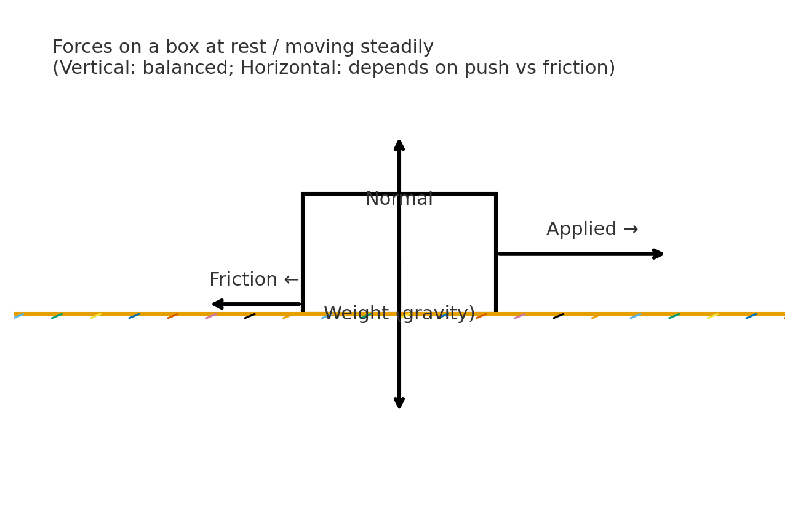
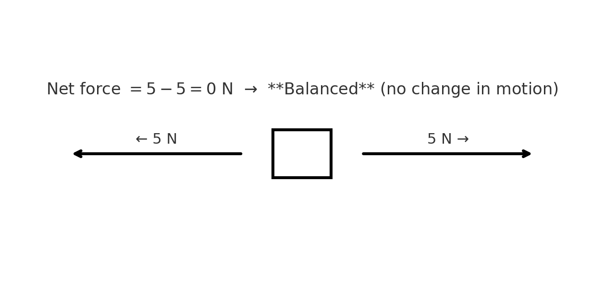
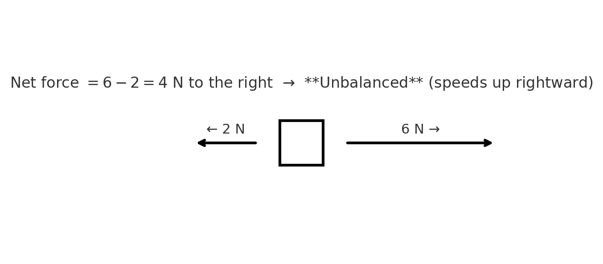
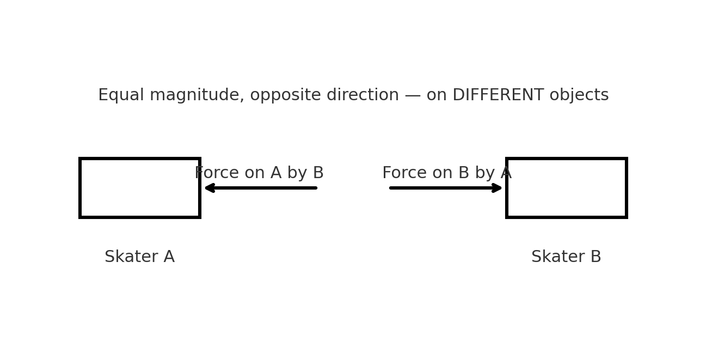
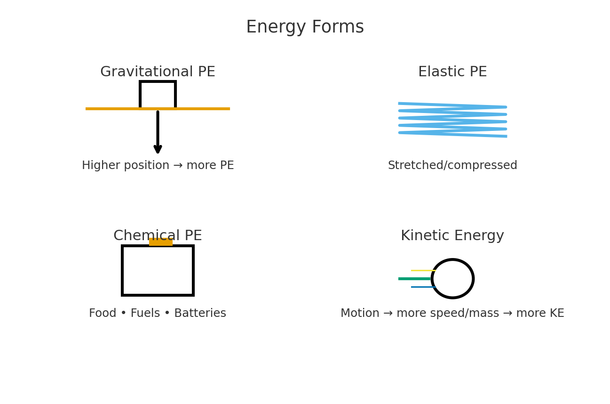
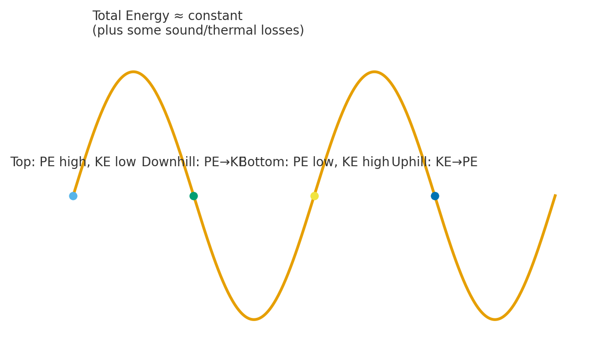
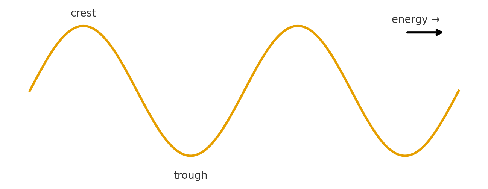
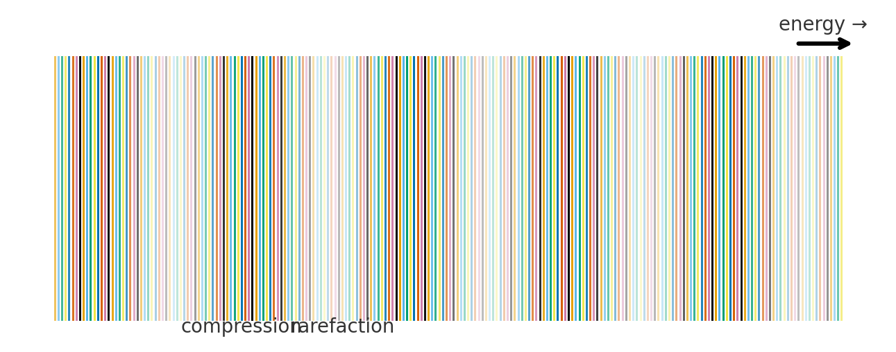

# Grade 6 Science — Module 4: Force, Motion & Energy

> **Big Idea:** Forces can balance or unbalance motion. Energy is stored (potential) or in motion (kinetic), and the **total energy in a system is conserved** as it transfers or transforms. Waves transfer energy without transferring matter.
---

## 4.1 Types of Forces (6.7A)

**Forces you’ll see a lot:**

* **Gravity** — pulls objects toward Earth (downward near Earth’s surface).
* **Normal force** — the **support** push from a surface, perpendicular to it.
* **Friction** — resists sliding between surfaces; acts **opposite** motion.
* **Applied force** — a push or pull you (or a machine) exert.
* **Magnetism** — forces between magnetic objects/fields.

**Picture — forces on a box**

**Try it (quick check):**

1. A book **rests** on a table. Name the two vertical forces acting on it and their directions.
2. A student pulls a sled to the right. Which force fights the motion along the ground?

> Grade 6 identifies and explains gravity, friction, magnetism, applied, and normal forces with real-world examples.

---

## 4.2 Net Force & Balanced vs. Unbalanced (6.7B)

**Net force** is the **overall** (combined) force acting on an object, including direction.

**Horizontal example (one dimension):**
If arrows are opposite, subtract magnitudes and keep the direction of the **larger** force:
[$
\text{Net force (horizontal)}=F_{\text{right}}-F_{\text{left}}
$]
If the result is positive → right; if negative → left.

**Balanced forces:** net force $(=0,\text{N})$ → **no change in motion** (object stays at rest or continues same speed/direction).
**Unbalanced forces:** net force $(\ne 0)$ → **motion changes** (start/stop/speed up/slow down/change direction).

**Pictures — balanced vs unbalanced**

**Practice — compute net force and state “balanced” or “unbalanced”:**

1. Left 3 N, Right 3 N → Net = (__) ; ____
2. Left 2 N, Right 7 N → Net = (__) ; ____ (direction?)
3. Up 50 N, Down 50 N → Net = (__) ; ____ (What does this say about vertical motion at that moment?)

> Grade 6 calculates **net force in horizontal or vertical** directions from diagrams and determines if forces are balanced or unbalanced.

---

## 4.3 Newton’s Third Law (6.7C)

**Rule:** For every interaction, there’s a **pair** of forces that are **equal in magnitude and opposite in direction**, acting on **different objects**.

**Examples you know:**

* **Jumping** — your legs push the ground **down**; the ground pushes **you up**.
* **Skate push** — two skaters push; each feels the **same size** force, opposite directions.
* **Magnet & fridge** — magnet pulls fridge; fridge pulls magnet equally.

**Picture — two skaters**

**Important:** Third-law pairs are **not** the forces that cancel on one object. (Equal & opposite **on the same object** can balance; third-law pairs act on **different** objects.)

> Grade 6 studies motion via **Newton’s Third Law** (First & Second Laws come later). ([Legal Information Institute][1])

**Practice — identify the force pairs:**

1. A ball hits a wall. Name the two forces in the interaction pair.
2. A magnet attracts a paper clip. Which two objects exert equal & opposite forces?

---

## 4.4 Energy Forms: Potential vs. Kinetic (6.8A)

* **Potential energy (PE)** — **stored** energy because of position or condition:

  * **Gravitational PE:** higher position → more PE.
  * **Elastic PE:** stretched/compressed springs, rubber bands.
  * **Chemical PE:** stored in food, batteries, fuels.
* **Kinetic energy (KE)** — energy of **motion**; faster → more KE; more mass → more KE (qualitatively).

**Picture — comparing energy forms**

**Sort these (PE vs KE) and explain:**
a) A book on a high shelf.
b) A moving soccer ball.
c) A stretched slingshot band.
d) Batteries powering a flashlight.

> Grade 6 compares gravitational, elastic, chemical **potential** energies with **kinetic** energy.

---

## 4.5 Energy Conservation: Transfers & Transformations (6.8B)

**Conservation:** In a closed system, the **total energy stays the same** while it **transfers** (moves between objects/parts) or **transforms** (changes form).

**Everyday systems:**

* **Roller coaster:** at the top, high **PE**; downhill, PE → **KE**; at bottom, most energy is KE; some transforms to sound/thermal.
* **Food web:** sun → plants (light → chemical) → animals (chemical → motion/thermal).
* **Electrical circuit:** battery (chemical) → electrical → bulb (light + thermal).

**Picture — coaster energy story**

**Practice — circle transfers & transformations:**

* Solar panel charging a battery → light $(\to)$ electrical $(\to)$ chemical (**transformation**).
* Warm mug heating your hands → **transfer** from mug to hand; some energy transforms to thermal in your skin.

---

## 4.6 Waves: How Energy Travels (6.8C)

**Waves transfer energy** from one place to another **without** the medium (material) moving along with the energy overall.

**Two big categories:**

* **Transverse waves** — the medium moves **up/down** (or side-to-side) **perpendicular** to the direction energy travels. *(Light and water-surface ripples behave like this.)*

  * **Crest** = high point, **trough** = low point.
* **Longitudinal waves** — the medium **vibrates back and forth** **parallel** to energy travel; areas of **compression** and **rarefaction** move along. *(Sound in air behaves like this.)*

**Pictures — transverse vs longitudinal**

**Vocabulary:** wavelength $(\lambda)$, amplitude, frequency (qualitative).
**Note:** In Grade 6, focus on recognizing types and describing how they transfer energy.

**Practice — identify the wave type & label features:**

1. A slinky pushed and released along its length: **type?** Mark a **compression**.
2. A rope snapped up and down: **type?** Mark a **crest** and **trough**.

---

## Mixed Review (Module 4)

1. A 7 N push right and a 3 N friction left act on a cart.
   a) Net force (=) (__) N; **direction?**
   b) Balanced or unbalanced?
2. Name the **third-law pair** when a swimmer pushes the water back.
3. Classify each as **PE** or **KE** (and which kind, if PE):
   a) Drawn bowstring; b) Battery in a toy car; c) A rolling marble.
4. Describe **one transfer** and **one transformation** in a toaster.
5. For a **transverse** wave, point to a **crest**; for a **longitudinal** wave, point to a **compression**.

---

## Answer Key (for adults)

1. a) (7-3=4) N right; b) **Unbalanced**.
2. Swimmer pushes **water backward**; water pushes **swimmer forward** (equal & opposite, on different objects).
3. a) **Elastic PE**; b) **Chemical PE**; c) **KE**.
4. **Transfer:** electrical energy from outlet $(\to)$ heating element; **Transformation:** electrical $(\to)$ thermal (plus some light/sound).
5. Crest = high point on transverse diagram; Compression = tightly spaced region on longitudinal diagram.

---

# Module 4 — Quizzes & Practice Pack

## Quiz A — Multiple Choice (Form 1)

**1)** A book is resting on a table. Which **two vertical forces** act on the book?
A. Gravity down & friction up
B. Gravity down & normal up
C. Normal down & gravity up
D. Applied up & friction down

**2)** A sled has $(6~\text{N})$ pulling to the right and $(2~\text{N})$ friction to the left. The net force is:\
A. $(8~\text{N})$ right\
B. $(4~\text{N})$ right\
C. $(4~\text{N})$ left\
D. $(3~\text{N})$ right

**3)** If leftward is negative, the net horizontal force for $(10~\text{N})$ left and $(4~\text{N})$ right is:\
A. $(-14~\text{N})$ \
B. $(-6~\text{N})$ \
C. $(+6~\text{N})$ \
D. $(+14~\text{N})$

**4)** **Balanced forces** mean the net force equals: \
A. $(1~\text{N})$\
B. $(0~\text{N})$\
C. $(10~\text{N})$\
D. Depends on mass

**5)** Which is a correct **Newton’s Third Law** pair?\
A. Hand pushes wall; wall pushes hand\
B. Gravity pulls apple; table pushes apple\
C. Friction slows box; gravity pulls box\
D. Rope pulls box; box moves

**6)** A stretched rubber band mostly stores:\
A. Kinetic energy\
B. Elastic potential energy\
C. Chemical potential energy\
D. Sound energy

**7)** Which is mainly a **transfer** of energy (not a change of type)?\
A. Hot mug warming your hand\
B. Battery powering a bulb (chemical $(\to)$ electrical $(\to)$ light)\
C. Solar panel charging a battery (light $(\to)$ electrical $(\to)$ chemical) \
D. Toaster (electrical $(\to)$ thermal)

**8)** At the **top** of a coaster hill:\
A. KE high, PE low\
B. PE high, KE low\
C. KE and PE both zero\
D. KE high because it’s fastest

**9)** A wave in which particles move **perpendicular** to energy travel is:\
A. Longitudinal \
B. Transverse \
C. Sound \
D. Static

**10)** A region of **compression** and **rarefaction** traveling through a slinky best represents:\
A. Light wave \
B. Water ripple \
C. Longitudinal wave \
D. Transverse wave

**11)** Which change usually means **more energy carried by a wave** (qualitative)? \
A. Smaller amplitude \
B. Larger amplitude \
C. Lower frequency always \
D. No relation at all

**12)** Which force most directly **opposes sliding** motion on a surface? \
A. Gravity \
B. Normal \
C. Friction \
D. Magnetism

---

## Quiz B — Short Answer

**1)** Name **four forces** commonly analyzed in Grade 6 and give a real-life example for each.

**2)** Look at . List the **four labeled forces** and the direction of each.

**3)** A crate on the floor experiences $(7~\text{N})$ right pull and $(5~\text{N})$ left friction). \
a) Compute $(F_{\text{net}})$. \
b) State **balanced or unbalanced** and predict the motion change. 

**4)** Explain **Newton’s Third Law** using a swimmer pushing water.

**5)** Sort each as **potential** (name the kind) or **kinetic**: \
a) Book on a high shelf; \
b) Rushing waterfall; \
c) Compressed spring; \
d) A moving skateboard.

**6)** In one sentence each, give a **transfer** and a **transformation** of energy in a **flashlight**.

**7)** Compare **transverse** vs **longitudinal** waves. Include how the medium moves relative to energy travel.

**8)** In , label a **crest** and **trough**. In , label a **compression**.

---

## Quiz C — Diagram & Calculation Items

**1)** **Balanced or Not?**
From , copy the equation and explain why the motion does **not** change.

**2)** **Net Force with Sign**
In , take right as (+). Calculate $(F_{\text{net}})$ using $(F_{\text{net}}=F_{\text{right}}-F_{\text{left}})$ and state the direction.

**3)** **Vertical Forces**
A $(120~\text{N})$ backpack hangs from a scale.
a) What is the **upward** force from the scale if it’s at rest?
b) If a student briefly **pulls down** with $(30~\text{N})$, what’s the instantaneous net vertical force (take up as (+))?

**4)** **Action–Reaction**
Using , write the two forces as “Force on (__) by (__)” with directions.

**5)** **Energy Story**
In , label a point of **highest PE**, a point of **highest KE**, and describe one **transformation** happening along the path.

**6)** **Wave ID**
For , draw an arrow showing **energy direction** and circle a **crest**.
For , mark one **compression** and one **rarefaction** region.

---

## Mini-Lab Ticket (Optional, 10–15 min)

**Goal:** Decide if forces on a sliding block are balanced or unbalanced and connect to speed changes.
**Setup:** Smooth book, flat table, spring scale (or gentle pull), stopwatch, 1-meter tape.
**Plan:**

1. Pull the book with a **steady** gentle force; time the 1 m distance.
2. Repeat with a **stronger** steady force.
3. Compare times; explain using **net force** and **friction**.
4. Where do you see **energy transfer** (book–table, your hand–book)?

---

## Challenge Problems

**1)** A child pushes a box with $(12~\text{N})$ to the right. Friction is $(8~\text{N})$ left. Suddenly a friend helps with $(5~\text{N})$ to the right. \
a) New $(F_{\text{net}})$ and direction? \
b) Balanced or unbalanced? Predict what happens to the speed.

**2)** A yo-yo at the **bottom** of its string has high **KE** and low **PE**; at the **top** the situation reverses. Describe one **transfer** and one **transformation** in this system.

**3)** A sound wave travels through air. Is it transverse or longitudinal? How do you know? What are the **compressions** physically?

**4)** Two skaters push apart. Skater A is twice the mass of Skater B. \
a) Compare the **forces** each experiences during the push. \
b) Which one changes speed more quickly? Explain without formulas.

---

# Answer Key

### Quiz A

1. **B** — Gravity down & normal up
2. **B** — $(6-2=4~\text{N})$ right
3. **B** — $(-10+4=-6~\text{N})$ left
4. **B** — $(0~\text{N})$
5. **A** — Hand on wall; wall on hand (equal & opposite on different objects)
6. **B** — Elastic PE
7. **A** — Heat moving from mug to hand is mainly a **transfer**
8. **B** — PE high, KE low
9. **B** — Transverse
10. **C** — Longitudinal
11. **B** — Larger amplitude $(\Rightarrow)$ more energy (qualitative)
12. **C** — Friction

### Quiz B

1. Sample: **gravity** (falling apple), **normal** (floor pushes up on your feet), **friction** (tires vs road), **applied** (pushing a cart), **magnetism** (magnet picks up paper clip).
2. From : **Weight** (\downarrow), **Normal** (\uparrow), **Applied** $(\rightarrow)$, **Friction** $(\leftarrow)$.
3. $(F_{\text{net}}=7-5=2~\text{N})$ right; **unbalanced**, so it speeds up rightward (or slows less if already moving left).
4. Swimmer pushes **water backward**; water pushes **swimmer forward** (equal & opposite, different objects).
5. a) **Gravitational PE**, b) **KE**, c) **Elastic PE**, d) **KE**.
6. **Transfer:** electrical energy moves from battery to bulb; **Transformation:** chemical $(\to)$ electrical $(\to)$ light/thermal.
7. **Transverse:** medium moves **perpendicular** to energy direction; **Longitudinal:** medium vibrates **parallel** (compressions/rarefactions).
8. Crest/trough and compression regions as labeled on the diagrams.

### Quiz C

1. Balanced: arrows equal and opposite; equation like $(5-5=0~\text{N}) (\Rightarrow)$ **no change** in motion.

2. $(F_{\text{net}}=6-2=4~\text{N}) (right)$.

3. a) $(+120~\text{N})$ up from the scale (balances weight at rest).
   b) Take up $(+)$: forces up $(=120)$, down $(=120 + 30)$. Net $(=+120-(120+30)=-30~\text{N})$ $(down)$.

4. Force on **A by B** (left on A); Force on **B by A** (right on B) — equal magnitude, opposite direction.

5. Highest **PE** at the **top**; highest **KE** at the **bottom**; e.g., **transformation**: gravitational PE $(\to)$ KE (plus some to thermal/sound).

6. Transverse: arrow to the right for energy; circle a crest. Longitudinal: mark tight **compression** bands and wider **rarefaction** bands.

### Challenge

1. $(F_{\text{right}}=12+5=17~\text{N})$; left $(=8~\text{N})$. Net $(=17-8=9~\text{N})$ right → **unbalanced**, so it speeds up to the right.
2. **Transfer:** string tension transfers energy between yo-yo and string; **Transformation:** gravitational PE $(\leftrightarrow)$ KE (with some to thermal/sound).
3. **Longitudinal**; the compressions are regions where air molecules are closer together (higher pressure).
4. **Forces equal** (third law). **Skater B** (smaller mass) changes speed more (greater acceleration for same force).
