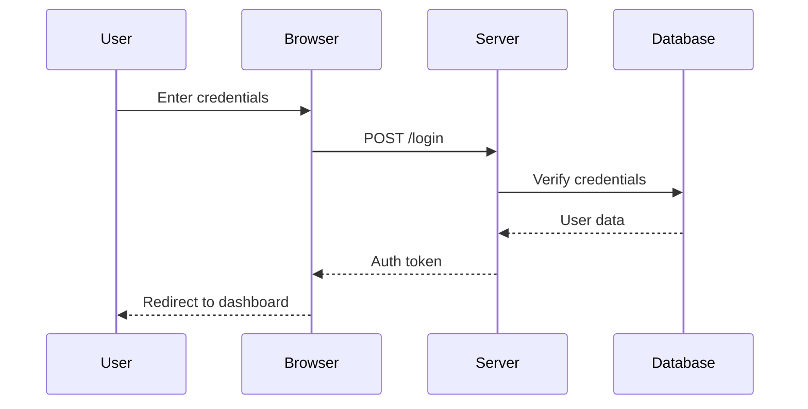
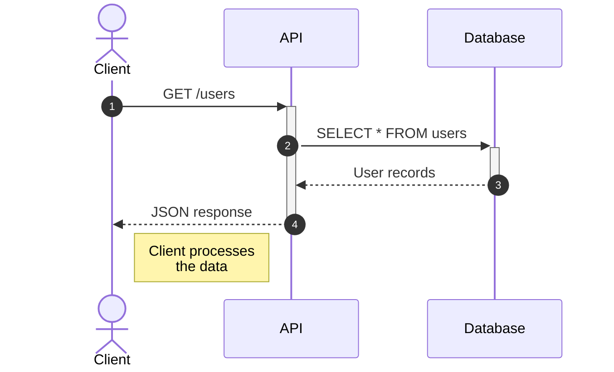
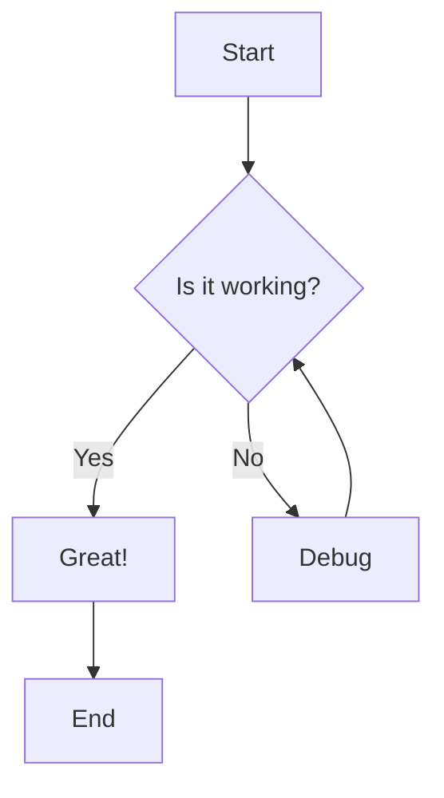
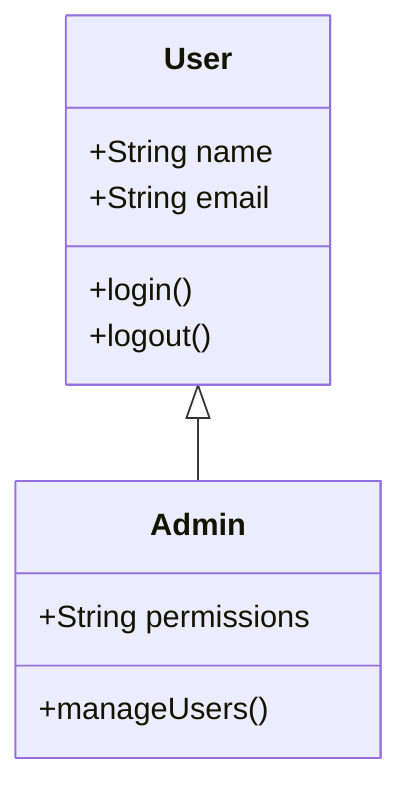
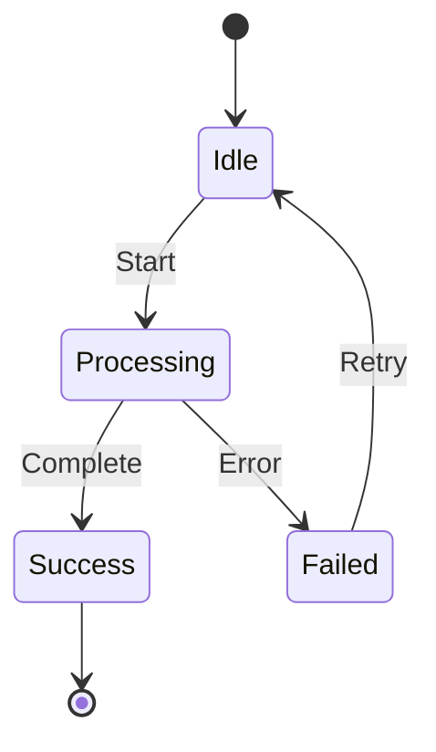
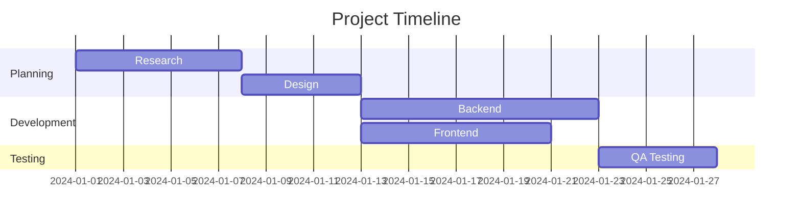
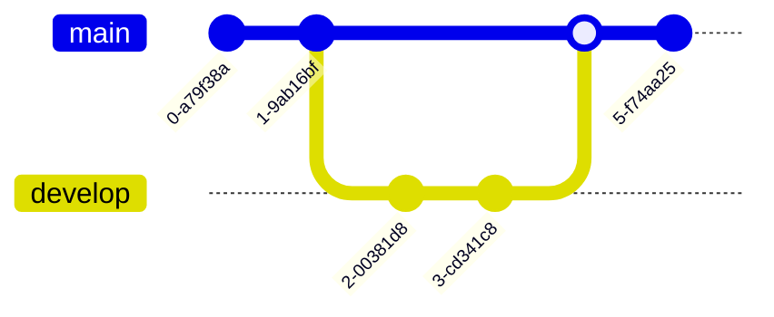

# Mermaid Diagram Examples

## Sequence Diagram

Here's a simple sequence diagram showing user authentication:

## Another Sequence Diagram

This shows an API request flow:

## Flowchart Example

## Class Diagram

## State Diagram

## Gantt Chart

## Git Graph

## More Text

You can mix diagrams with regular markdown content. The diagrams will be rendered inline with your text, math equations, and other content.

Math still works: $E = mc^2$

And display math:

$$
\int_{-\infty}^{\infty} e^{-x^2} dx = \sqrt{\pi}
$$
