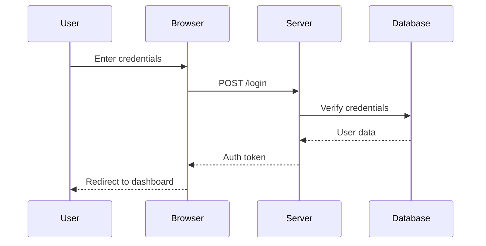
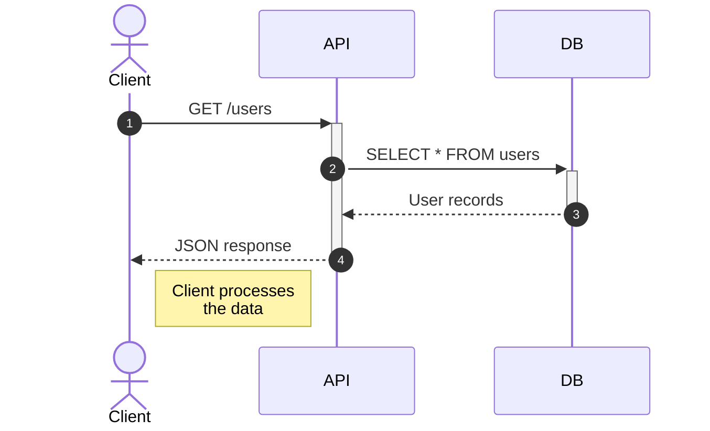
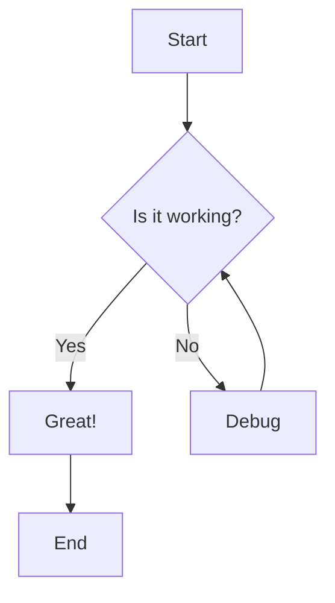
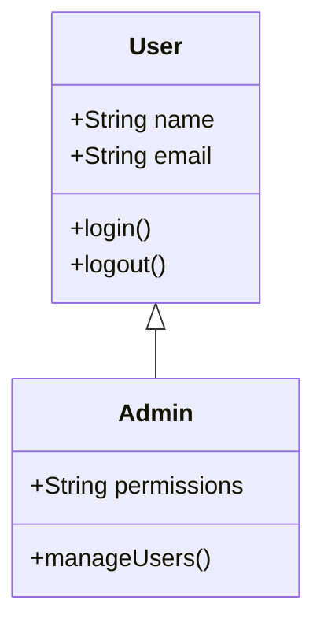
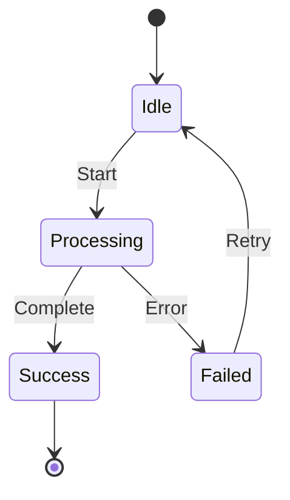
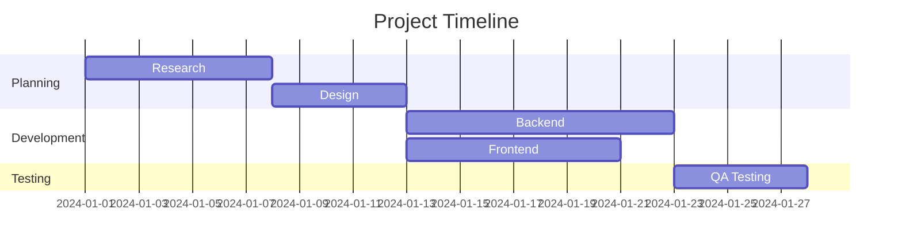
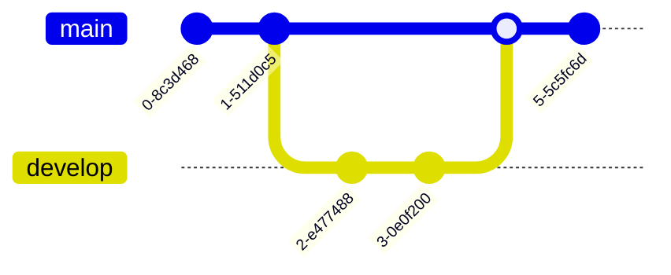

title: "Markdown Torture Test"
description: "Full feature coverage for renderer: math, mermaid, images, tables, lists, HTML, etc."
version: 1.0.0
---

# Markdown Torture Test

> **Big Idea:** This single doc should render *everything* my viewer supports:
> - math (inline `$...$`, `[ $...$ ]`, display `$$...$$`, and ```math``` fences)
> - mermaid (sequence, flowchart, state, gantt, class, gitGraph)
> - images (local file path, base64 data URI, remote URL)
> - lists, tables, code fences, blockquotes, callouts, footnotes
> - headings, inline HTML, custom spans, etc.
>
> If any section below looks broken, that's where the renderer needs work.

---

## Table of Contents

1. [Headings & Text Styles](#1-headings--text-styles)
2. [Lists & Task Lists](#2-lists--task-lists)
3. [Inline Code and Code Fences](#3-inline-code-and-code-fences)
4. [Blockquotes (nested)](#4-blockquotes-nested)
5. [Images (file, data URI, remote)](#5-images-file-data-uri-remote)
6. [Tables (alignment, math in cells)](#6-tables-alignment-math-in-cells)
7. [Math Stress Test](#7-math-stress-test)
8. [Physics / Forces / Energy Examples](#8-physics--forces--energy-examples)
9. [Fractions, Decimals, Percents](#9-fractions-decimals-percents)
10. [Geometry & Measurement](#10-geometry--measurement)
11. [Mermaid Diagrams](#11-mermaid-diagrams)
12. [HTML Embeds / Details / Footnotes](#12-html-embeds--details--footnotes)
13. [Git-style Diff / JSON / Edge Cases](#13-git-style-diff--json--edge-cases)

---

## 1. Headings & Text Styles

# H1 Title
## H2 Subtitle
### H3 Section
#### H4 Detail
##### H5 Tiny
###### H6 Smallest

Normal paragraph text.  
This line ends with two spaces⟶ so it should force a line break  
like this.

**Bold text**, *italic text*, and ***bold+italic text***.

Inline code like `this_is_not_italic` and ``code with `backticks` inside``.

Escaped characters: \*not a list item\*, \_not emphasis\_, \# not a heading.

A link to [an inline URL](https://example.com).  
A reference link to [the same place][example-ref].

[example-ref]: https://example.com "Example site tooltip"

---

## 2. Lists & Task Lists

**Unordered list**

- Gravity
- Friction
  - static friction
  - kinetic friction
    - ultra-nested item with math $F_\text{friction}$
- Normal force (support force)

**Ordered list (should auto-number even if I write `1.`)**

1. First thing
1. Second thing
1. Third thing with inline math: $E = mc^2$

**Checklist / task list**

- [ ] Unchecked box: Add screenshots
- [x] Checked box: Render LaTeX like `\frac{a}{b}`
- [ ] Half-done item with sub-steps:
  - [x] subtask A
  - [ ] subtask B

---

## 3. Inline Code and Code Fences

Inline code uses backticks like `console.log("hello")`.

```js
// JavaScript example
function greet(name) {
  console.log(`Hi, ${name}!`);
}
greet("world");
````

```python
# Python example
def area_triangle(b, h):
    # A = 1/2 * b * h
    return 0.5 * b * h
print(area_triangle(10, 4))
```

```csharp
// C# example
public record User(string Name, int Age);

var u = new User("Alice", 12);
Console.WriteLine(u);
```

```diff
- old line that was removed
+ new line that was added
```

```json
{
  "name": "renderer-check",
  "version": "1.0.0",
  "features": ["math", "mermaid", "latex", "images/base64"]
}
```

---

## 4. Blockquotes (nested)

> This is a blockquote level 1.
>
> > This is a nested blockquote level 2 with math:
> >
> > [$ \text{Net force} = F_{\text{right}} - F_{\text{left}} $]
> >
> > If the result is positive, motion is to the right.
>
> Back to level 1.
>
> * Bullet inside blockquote
> * Still should render fine

---

## 5. Images (file, data URI, remote)

### 5.1 Local / relative images

These mimic the style in force/energy lessons where you referenced local PNG assets like `forces_box.png`, `wave_transverse.png`, etc.


> If your renderer supports `` fallback, both images above should show up (or at least show alt text).
> These filenames appear in the Force, Motion & Energy module alongside explanations of normal force, gravity, and wave types.
> The first diagram usually shows gravity down, normal force up, etc.

### 5.2 Base64-encoded data URI image

Tiny 1×1 transparent PNG embedded directly in Markdown:


If that renders, you support data URIs. (Useful for offline math diagrams.)

### 5.3 Remote URL image


---

## 6. Tables (alignment, math in cells)

### 6.1 Basic alignment

| Quantity                |      Symbol      | Meaning                                        | Notes                                    |
| :---------------------- | :--------------: | ---------------------------------------------- | ---------------------------------------- |
| Force                   |        $F$       | A push or pull                                 | Usually measured in Newtons $(\text{N})$ |
| Gravitational Potential |      $PE_g$      | Stored energy due to height                    | "Higher = more PE"                       |
| Kinetic Energy          |       $KE$       | Energy of motion                               | Faster $\rightarrow$ higher $KE$         |
| Net Force               | [$F_\text{net}$] | Overall force after combining pushes and pulls | $0$ means **balanced**                   |

Note that the `[$F_\text{net}$]` cell intentionally wraps math with square brackets.

### 6.2 Table with images + math

| Wave Type       | Sketch                                                                                                                        | Key Feature                                                    |
| --------------- | ----------------------------------------------------------------------------------------------------------------------------- | -------------------------------------------------------------- |
| Transverse      |                                                                                             | Particles move ⟂ to energy flow (crest / trough)               |
| Longitudinal    |                                                                                         | Particles compress $\rightarrow$ expand $\rightarrow$ compress |
| Light Intensity |  | Approx. proportional to amplitude$^2$                          |

> In Grade 6 science, you identify transverse vs. longitudinal waves and label crests, troughs, and compressions. You also say waves transfer **energy** but not overall matter motion.

---

## 7. Math Stress Test

This section exercises ALL math formats you’ve been using.

### 7.1 Inline math

Inline fraction like $\frac{a}{b}$, unit fraction $\frac{1}{4}$, mixed number $1\frac{3}{4}$, chemical formula $\text{H}_2\text{O}$, and reaction arrow $\rightarrow$.

Charge notation $\text{Mg}^{2+}$ and electron $e^-$.

Ideal gas law $PV = nRT$.

pH: $\text{pH} = -\log_{10} [\text{H}^+]$.

### 7.2 Bracketed inline math blocks

Sometimes you wrap math in square brackets on its own line (this shows up all over your math workbook pages and science force summaries).
Renderer should keep the brackets text, not eat them.

[
$\frac{a}{b} \times \frac{c}{d}
= \frac{a \times c}{b \times d}$
]

[
$\text{Area} = \frac{1}{2} b h$
]

[
$\text{Net force (horizontal)} = F_{\text{right}} - F_{\text{left}}$
]

[
$K_c = \dfrac{[\text{NH}_3]^2}{[\text{N}_2][\text{H}_2]^3}$
]

### 7.3 Display math with `$$ ... $$`

Below is Gaussian integral style (should center and render as block):

$$
\int_{-\infty}^{\infty} e^{-x^2} , dx = \sqrt{\pi}
$$

Another:

$$
\text{GCF}(56,42) = 14
$$

and

$$
\text{LCM}(15,9) = 45
$$

### 7.4 Fenced math block (```math)

```math
p(n) \sim \frac{1}{4n\sqrt{3}}
\exp\!\left( \pi \sqrt{\frac{2n}{3}} \right)
\quad \text{as } n \to \infty
```

```math
\frac{1}{\pi}
=
\frac{2\sqrt{2}}{9801}
\sum_{k=0}^{\infty}
\frac{(4k)!\,(1103+26390k)}
     {(k!)^4 \, 396^{4k}}
```

```math
R(q)
=
q^{1/5}
\;\bigg/\;
\left(
1 + \frac{q}{1 + \frac{q^2}{1 + \frac{q^3}{1 + \cdots}}}
\right)
```

These match the Ramanujan-style ` ```math ` fences with continued fractions, factorials, $\sum$, etc.

### 7.5 Mixed text + math + commas like in chemistry

$ \text{HCl} + \text{NaOH} \rightarrow \text{NaCl} + \text{H}_2\text{O} $

$ \text{N}_2 (g) + 3,\text{H}_2 (g) \rightleftharpoons 2,\text{NH}_3 (g) $

Notice the coefficient + comma style before \text{H}_2, matching chemistry notes.

---

## 8. Physics / Forces / Energy Examples

### 8.1 Balanced vs. Unbalanced Force

* Balanced forces → net force $=0,\text{N}$ → object keeps same motion (either stays still or same constant speed).
* Unbalanced forces → net force $\ne 0$ → motion changes (speed up, slow down, turn).

**Example problem:**

Left $3\ \text{N}$, Right $7\ \text{N}$

[
$\text{Net force} = 7\text{N}*\rightarrow - 3\text{N}*\leftarrow = 4\text{N to the right}$
]

That is **unbalanced**, so motion will change.

### 8.2 Newton’s Third Law

> For every interaction, there is an equal and opposite force pair acting on **different objects**.

Skater pushes ground **back**; ground pushes skater **forward** with equal size.
Magnet pulls fridge; fridge pulls magnet, same size and opposite direction.

This mirrors the wording in your Module 4 section on 3rd law (push/pull pairs like skater vs. ground).
Also: The two forces in a 3rd-law pair do **not** cancel each other on one object.

### 8.3 Energy transfer / transformation

Roller coaster story:

* At the top: mostly gravitational potential energy (PE).
* Going down: PE $\rightarrow$ kinetic energy (KE).
* Bottom: mostly KE, plus some energy that became sound and heat.

In a toaster:

* Electrical energy transfers from outlet to toaster coil.
* Electrical $\rightarrow$ thermal (heat) in the coil and bread.

These match your conservation-of-energy wording. Energy is conserved in the system, but it can move (transfer) or change form (transform).

---

## 9. Fractions, Decimals, Percents

### 9.1 Converting fractions to decimals to percents

Example: $\frac{5}{8} = 0.625 = 62.5%$

[
$\frac{4}{5} = \frac{80}{100} = 80%$
]

$ \frac{1}{2} = 0.5 = 50% $

Benchmark percents you use a lot:

* $1%$
* $5%$
* $10%$
* $25%$
* $50%$
* $100%$

These “easy percents” (especially 10% → 5% → 1%) are used to build any other percent of a number, like finding $28%$ of $500$ by combining $10%$, $5%$, $1%$, etc.

### 9.2 Reciprocal / multiplicative inverse

The reciprocal of $\frac{a}{b}$ is $\frac{b}{a}$ because

[
$\frac{a}{b} \times \frac{b}{a} = 1$
]

Dividing by a fraction is the same as multiplying by its reciprocal:

[
$6 \div \frac{1}{2} = 12$
]

Ask: “How many $\frac{1}{2}$ pieces fit into $6$ wholes?” Answer: 12 pieces.

### 9.3 Comparing decimals

Compare $0.35$ and $\frac{1}{2}$:

$\frac{1}{2} = 0.5$ so $0.5 > 0.35$.

Line them on a number line from 0 to 1: which one is farther right?

Also: place value matters (tenths, hundredths, thousandths, …).

---

## 10. Geometry & Measurement

### 10.1 Triangle rules

* **Triangle Inequality Theorem:** The sum of any two sides must be greater than the third side.
  If not, triangle is impossible.
* **Triangle Sum Theorem:** The interior angles of any triangle add to $180^\circ$.
* Longest side ↔ biggest angle (the side opposite the largest angle is longest).

### 10.2 Area formulas

Parallelogram area:

[
$\text{Area} = b \times h$
]

Triangle area:

[
$\text{Area} = \frac{1}{2} b h$
]

Trapezoid area:

[
$\text{Area} = \frac{1}{2} (b_1 + b_2) h$
]

These formulas match your “Shapes and Solids” sections.

### 10.3 Volume of right rectangular prism

Volume (rectangular prism):

[
$V = \ell \times w \times h$
]

Even if $\ell$, $w$, and $h$ are fractions or mixed numbers like $1\frac{1}{2}$, $\frac{1}{2}$, $\frac{3}{4}$, you still multiply them.

---

## 11. Mermaid Diagrams

Your renderer should treat these as Mermaid code blocks, not plain text.
They intentionally include:

* `sequenceDiagram` with `participant`, arrows (`->>` / `-->>`)
* `autonumber`
* `<br/>` in notes
* `flowchart` with condition diamonds
* `classDiagram`
* `stateDiagram-v2`
* `gantt`
* `gitGraph`

### 11.1 Sequence diagram (login flow)



### 11.2 Sequence diagram with autonumber + note



### 11.3 Flowchart



### 11.4 Class diagram



### 11.5 State diagram



### 11.6 Gantt chart



### 11.7 Git graph



---

## 12. HTML Embeds / Details / Footnotes

This section checks if inline HTML survives.

A span with styling: <span style="color:red; font-weight:bold;">This text should appear red & bold if inline styles are allowed.</span>

Line break test with `<br/>`:
First line<br/>Second line after `<br/>`.

<details>
  <summary>Click to expand details (HTML &lt;details&gt; test)</summary>

Inside the `<details>` block we can put **bold text**, lists, and math.

[
$\text{Volume} = \ell \times w \times h$
]

* Point A
* Point B
* Point C with inline math $a^2 + b^2 = c^2$

</details>

Footnote test:
This sentence has a footnote marker.[^1]

[^1]: This is the footnote content. It should render at the bottom or inline depending on your renderer.

---

## 13. Git-style Diff / JSON / Edge Cases

**Git-style diff block was already shown above**, but here is another:

```diff
@@ Energy Transfer @@
- Energy disappears as heat.
+ Total energy is conserved, but some is transformed to thermal energy.
```

**Escapes and tricky punctuation**

* Backslash at end of line to force no newline continuation
  Still same logical line.
* Underscore_in_plain_text_that_should_NOT_turn_into_italics
* Asterisks *inside* a word
* HTML entity test: α β γ should render as α β γ

**Mathematical limits, sums, products**

```math
\lim_{x \to 0} \frac{\sin x}{x} = 1
```

```math
\sum_{n=1}^{\infty} \frac{1}{n^2} = \frac{\pi^2}{6}
```

```math
\prod_{k=1}^{m} k = m!
```

---

### End of File

If you can scroll all the way down here and everything above rendered
(especially mermaid, LaTeX math, data URI images, tables with math, and task lists),
your Markdown + MathJax + Mermaid + image pipeline is in good shape ✅

```
```
