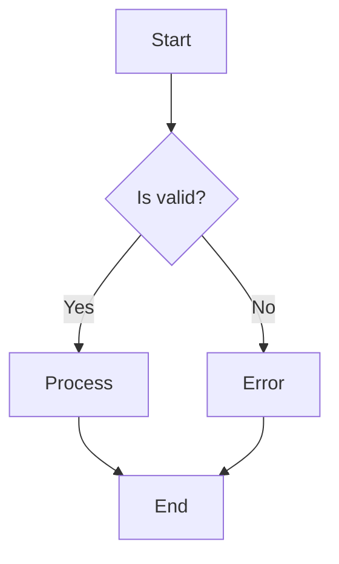
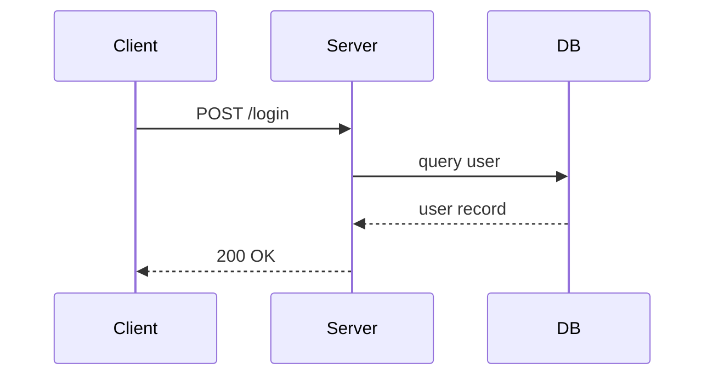
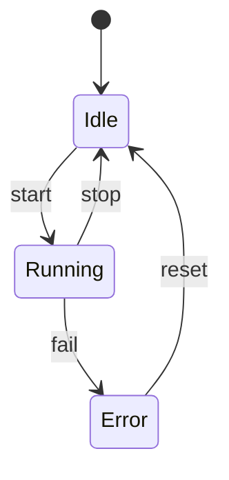

# Mermaid Diagrams Test

## Flowchart

```mermaid
flowchart TD
    A[Start] --> B{Is valid?}
    B -->|Yes| C[Process]
    B -->|No| D[Error]
    C --> E[End]
    D --> E
```

## Sequence Diagram

```mermaid
sequenceDiagram
    participant Client
    participant Server
    participant DB
    Client->>Server: POST /login
    Server->>DB: query user
    DB-->>Server: user record
    Server-->>Client: 200 OK
```

## State Diagram

```mermaid
stateDiagram-v2
    [*] --> Idle
    Idle --> Running : start
    Running --> Idle : stop
    Running --> Error : fail
    Error --> Idle : reset
```
