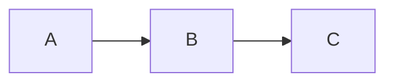

# Test Document

This is a **test** markdown document.

## Section A

Some paragraph text with inline math $a^2 + b^2 = c^2$ and a code block:

```
function hello(name) {
  return `Hello ${name}`;
}
```

### Subsection A1

A list:
- Item 1
- Item 2

A block equation:

$$E = mc^2$$


